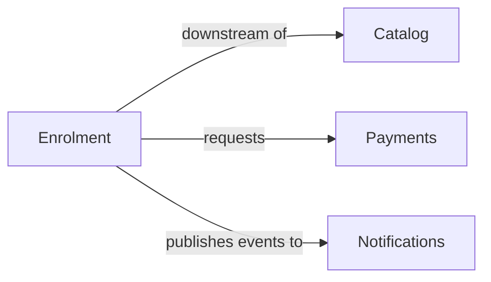

# Domain Decompose

Turn a prose domain/requirements description into a Domain-Driven Design decomposition — bounded
contexts → aggregates → entities, value objects, and domain events — named in the business's
ubiquitous language; each context doubles as a candidate service boundary on the monolith →
microservices path.

**Strategic-then-tactical** and **hybrid**: produce a first-pass model from what you're given,
then ask targeted questions only where boundaries or ownership are genuinely ambiguous — don't
re-ask what the description already settles, and never invent business rules.

## Inputs

A domain description: feature list, PRD, process narrative, key capabilities, actors, notable
events. If the user points at code instead, say this skill models from domain knowledge, not
code, and ask for a description (or the key capabilities and rules) — reverse-engineering a
codebase is out of scope.

**Brownfield** (the model lives only in code, nothing written down): don't reverse it from the
code. Ask for a one-page sketch — main capabilities, key events (past-tense things that happen),
any hard rules — enough for a first-pass model; step 5 refines the rest. If domain docs/PRDs *do*
exist, step 1 already picks them up.

## Reference files (read as needed)

- `references/ddd-methodology.md` — theory and heuristics behind every step (sub-domain types,
  boundary heuristics, aggregate/entity/VO/event criteria, naming). Read when a judgement call
  needs grounding.
- `references/bounded-context-canvas.md` — template + guidance for each context's `README.md`.
- `references/aggregate-design-canvas.md` — template + rules for modelling each aggregate.
- `references/output-template.md` — **the exact output contract** (where to write, file layout,
  schemas, frontmatter, hard rules). Read before emitting anything.

## Process

### 1. Find & reconcile existing domain artifacts
Before modelling, look for existing domain knowledge — re-deriving it wastes effort and risks
contradicting what the team already agreed. Look for PRDs, specs, design docs (`docs/specs/`,
`docs/**/prd/`, anything titled "… domain model"), code carrying a domain layer (`*/domain/`,
`*/ports/`), and **this skill's own prior output** in `docs/domain/`. Treat any you find as
**authoritative input**: build on them, preserve their names and stated rules verbatim, reconcile
rather than re-invent. Prior `docs/domain/` output puts you in **update mode** — you're merging a
delta, not writing from scratch; step 6 handles it.

**When two sources disagree** — e.g. a *draft* PRD models a `Fact` as `key`/`value` but shipped
code uses `content`/`source` — this is the highest-risk moment of the skill. Do **not** blend
their fields into one hybrid that exists in neither source: that is invention disguised as
reconciliation, the failure to avoid. Prefer the **running/shipped code** over a draft doc as
authoritative, but **always record each divergence explicitly** (source A says X, source B says Y,
chosen Z, why) in the Conflicts section of `context-map.md` and flag it for a human. Surfacing a
conflict is mandatory — a silently swallowed conflict is worse than an openly unresolved one.

### 2. Frame the input (event-storming style)
Skim the description and extract, in business language: **domain events** (past-tense things that
happen), the **commands/actors** that cause them, and the recurring **nouns**. Raw material — see
ddd-methodology.md §3. Don't formalize yet.

### 3. First-pass strategic decomposition
- Group events/nouns into **bounded contexts** by the boundary heuristics — a boundary is where
  the *language changes meaning*, cohesion high and coupling low (ddd-methodology.md §2.2, §2.4).
- Classify each **core / supporting / generic** — core = competitive differentiator; generic =
  commodity you could buy (§2.1).
- Sketch **relationships** between contexts (upstream/downstream, ACL, shared kernel, etc.).
- Name the **load-bearing extraction seam** — the boundary that decouples the system most if
  split first, often a *Published Language* artifact (an exported pack, a contract, a shared
  document) crossing contexts. State it explicitly and consider elevating it to its own context;
  it's usually the first service to extract on the monolith→microservices path — don't leave it
  buried inside a large context.

### 4. First-pass tactical model (per context)
For each context, identify **aggregates** (consistency boundaries) — each with its root entity,
member **entities** (identity), **value objects** (no identity, equal by value), and the **domain
events** it emits. Apply the aggregate rules in aggregate-design-canvas.md; name from the
ubiquitous language (see Naming below). A concept with an id, its own lifecycle/status, or
(brownfield) its own table/repository is an **entity** even if it looks data-like — don't demote
an identified concept to a value object.

Then run an **event-flow continuity check**: every emitted domain event should have at least one
consumer (a handler/policy in some context), and every cross-context arrow on the map should
correspond to an emitted event. Flag orphan emits and unconsumed events before finalizing — a
dropped or unconsumed edge is a real modeling bug, not a stylistic gap.

### 5. Ask targeted questions (only where ambiguous)
Surface the model, then ask **only** about genuine ambiguities — batch them:
- a term appears to mean different things in two candidate contexts (confirm the split),
- a context's core/supporting/generic classification isn't clear,
- two pieces of state may need atomic consistency across candidate aggregates,
- a concept's entity-vs-value-object nature is unstated,
- an invariant is implied but never stated (ask — do **not** fabricate it).

If the description already answers something, don't ask. If nothing is ambiguous, skip to step 6.

### 6. Emit the docs (create or delta-merge)
Follow `references/output-template.md` exactly. Detect the project's `docs/domain` convention (or
ask if none), then check whether it **already holds generated artifacts** (`DOMAIN-NNNN`
frontmatter, `INDEX.md` rows, per-context `model.yaml`):

- **Create mode** (empty/new): write `context-map.md` (Mermaid map + Core Domain Chart) and, per
  context, a folder with `README.md` (Bounded Context Canvas) + `model.yaml`. Fresh docs start
  `status: draft`, `owner: TBD`, with `DOMAIN-NNNN` ids; create `INDEX.md`.
- **Update mode** (prior output exists): **read it first**, then merge the new model in as a
  *delta* — same reconcile discipline as step 1, now pointed at your own past output. Reuse each
  existing context's `DOMAIN-NNNN` id, add/update only what changed, **preserve human edits**
  (escalated status, assigned owner, hand-written rules), **never delete** a context that's no
  longer in the model — flag it instead, and record real disagreements in the Conflicts table.
  Close with a short **changelog** (added / updated / preserved / flagged). The exact merge rules
  are in output-template.md §"Delta merge".

## Naming conventions

| Element | Convention | Example |
|---|---|---|
| Bounded Context | capability noun | `Booking`, `Inventory` |
| Aggregate | = its root entity | `Order` |
| Entity | singular domain noun | `Customer` |
| Value Object | descriptive noun, no id | `Money`, `DateRange` |
| Command | imperative | `PlaceOrder` |
| Domain Event | past tense | `OrderPlaced` |

The same word in two contexts is kept in both, qualified by context — that polysemy is the
*point* of bounded contexts, not a naming clash.

## Hard rules

- **Never invent business rules, invariants, or domain events.** Capture only what the user
  stated; flag gaps rather than filling them. Naming an event the prose *implies*
  (`AppointmentBooked` from "patients book appointments") is the job; inventing one for a flow the
  input never describes (an `AppointmentCancelled` when nothing is ever cancelled) is fabrication —
  don't. Fresh docs start `status: draft`, `owner: TBD`. In update mode,
  **preserve** whatever a human set — never reset an escalated status, assigned owner, or
  hand-written rule back to draft/TBD. Setting status (or reverting it) is a human act, not yours.
- Model from the **domain description, not code**.
- Boundaries and aggregates **will change** as understanding deepens — present the model as a
  draft to iterate, not a final truth.

## Worked example

**Input:** "Students browse our course catalog and enrol in courses. Enrolment requires payment;
we email a receipt and a welcome message. Instructors create and publish courses."

**First-pass contexts + classification (`context-map.md`):**



| Bounded Context | Sub-domain type | Why |
|---|---|---|
| Enrolment | core | the differentiating capability |
| Catalog | supporting | needed, not differentiating |
| Payments | generic | commodity — could be outsourced |
| Notifications | generic | commodity |

**Enrolment context (`docs/domain/enrolment/model.yaml`)** — tactical block (full schema in
output-template.md §4):

```yaml
context: Enrolment
subdomain_type: core
aggregates:
  - name: Enrolment
    root: Enrolment
    entities:
      - { name: Enrolment, attributes: [studentId, courseId, status] }
    value_objects:
      - { name: Money, attributes: [amount, currency] }
    domain_events:
      - { name: EnrolmentRequested, payload: [studentId, courseId] }
      - { name: EnrolmentConfirmed, payload: [enrolmentId] }
relationships:
  - { to: Payments, type: downstream }
  - { to: Catalog, type: downstream }
```

Note what the example does **not** do: it doesn't assert a rule like "a student may enrol in at
most 5 courses" because the input never said so. If that mattered, the skill would ask.
