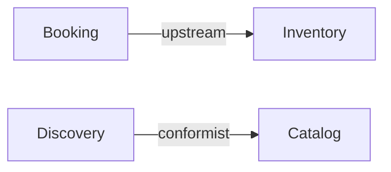

# Output Template — runtime artifacts

What `domain-decompose` writes at runtime. Output lands in the **invoking project's** docs folder
— never in this plugin repo or any reference template you studied. Read before emitting anything.

## 1. Locate the docs root (detection order)

1. If the project has `docs/domain/` with an `INDEX.md` and/or `_TEMPLATE.md` → **follow that
   convention**: reuse its frontmatter fields, its `INDEX.md` table shape, and its id scheme.
2. Else if `docs/` exists but no `domain/` → create `docs/domain/`.
3. Else (no `docs/` and no obvious convention) → **PAUSE and ask** the user where docs should
   live. Do not guess a path.

Detect rather than hardcode so the skill drops into any repo and stays consistent with the team's
docs and tooling.

If the located `docs/domain/` **already holds generated artifacts** (`DOMAIN-NNNN` frontmatter,
`INDEX.md` rows, or per-context `model.yaml`), you're updating, not creating — see §7 "Delta
merge". Otherwise create fresh.

## 2. Layout (organized per bounded context)

```
docs/domain/
├── context-map.md            # all contexts + relationships + Core Domain Chart
├── INDEX.md                  # table of generated docs (create if missing, else append)
└── <context-slug>/           # one folder per bounded context (kebab-case)
    ├── README.md             # Bounded Context Canvas (see references/bounded-context-canvas.md)
    └── model.yaml            # machine-readable model (schema below)
```

Bounded contexts are the unit of division. A context folder is a candidate service boundary on
the monolith → microservices path.

## 3. `context-map.md`

Two required blocks:

**Context map** — a Mermaid `graph` showing each bounded context as a node and labelled edges for
relationships (`upstream`/`downstream`, `shared-kernel`, `conformist`, `ACL`, `open-host`):



**Core Domain Chart** — a table classifying every context:

| Bounded Context | Sub-domain type | Why |
|---|---|---|
| Booking | core | competitive differentiator |
| Notifications | generic | commodity, could be bought |

**Conflicts & reconciliation** — **required whenever you reconcile existing artifacts that
disagree** (e.g. a draft PRD vs shipped code). One row per divergence. Never blend the two into a
hybrid; record both, choose the authoritative one (running code over a draft doc), and flag it.
Omit this block only when no existing sources conflict.

| Concept | Source A says | Source B says | Chosen (authoritative) | Flag for human |
|---|---|---|---|---|
| Fact shape | PRD-01 draft: `key`/`value` | code: `content`/`source` | code | confirm PRD migration |

## 4. `model.yaml` (per context)

```yaml
context: <ContextName>          # PascalCase, ubiquitous-language noun
subdomain_type: core            # core | supporting | generic
ubiquitous_language:
  - term: <Term>
    definition: <one line>
aggregates:
  - name: <AggregateName>       # named after its root entity
    root: <RootEntity>
    entities:
      - { name: <Entity>, attributes: [<attr>] }
    value_objects:
      - { name: <VO>, attributes: [<attr>] }     # no identity; equal by value
    domain_events:
      - { name: <EventPastTense>, payload: [<field>] }  # e.g. OrderPlaced
    invariants:
      - <statement>             # ONLY if the user supplied it; else omit
relationships:
  - { to: <OtherContext>, type: upstream }        # upstream|downstream|shared-kernel|conformist|acl|open-host
```

**Schema rule:** every aggregate MUST include the keys `entities`, `value_objects`, and
`domain_events` — use an empty list `[]` when it has none. Never omit a key, so the model stays
machine-consumable and consumers can rely on the shape. `invariants` is the only optional key
(include only user-stated rules).

## 5. Frontmatter on generated markdown docs

Reuse the project's convention if detected. Default (matches the monorepo template's
`docs/domain/_TEMPLATE.md`):

```yaml
---
id: DOMAIN-NNNN          # next free number; check INDEX.md
title: <Context> bounded context
risk: High               # High | Critical — only if invariants present, else omit
status: draft            # ALWAYS draft — never approved/accepted
owner: TBD               # ALWAYS TBD — ownership is a human act
date: YYYY-MM-DD
related_prds: []
related_rfcs: []
related_adrs: []
---
```

## 6. Update `INDEX.md`

One row per context, matching the existing columns. Create `INDEX.md` if missing
(`Id | Title | Risk | Status | Owner | Date`). In **update mode**, edit the existing row in place
(don't append a duplicate) and keep its human-set `Status`/`Owner`; add a row only for a genuinely
new context.

## 7. Delta merge (update mode)

When `docs/domain/` already holds generated artifacts, **read them before writing** and merge the
new model in as a delta. This is the step-1 reconcile discipline turned on your own past output:
build on it, don't clobber it. A re-run after the model evolved (or after humans edited the docs)
must feel like a careful diff, not a regeneration.

**Match by name, keep ids stable.** Match new contexts/aggregates/entities to existing ones by
their ubiquitous-language name. A matched context **keeps its existing `DOMAIN-NNNN` id**; only a
genuinely new context gets the next free number. Regenerating ids breaks `INDEX.md` and every
cross-reference — don't.

**Merge field-by-field, never whole-file overwrite:**

| Situation | Action |
|---|---|
| In the new model, absent on disk | **Add** it (context, aggregate, entity, VO, event, relationship). |
| In both, but the new model changed it (e.g. a new event, corrected attribute) | **Update** that field; leave the rest untouched. |
| On disk, absent from the new model | **Never delete.** Leave it in place and **flag** it as a candidate removal in the changelog — a dropped context is usually a modelling slip, and deletion is destructive. |
| A field a human set (status, owner, `related_*`, hand-written rules/notes/prose) | **Preserve verbatim.** These are human acts (see §8); never reset to draft/TBD. |
| In both, but the values disagree | **Don't blend.** Record both in the Conflicts table of `context-map.md` (§3), choose the authoritative side, flag for a human. |

**Close with a changelog** so the user sees exactly what the re-run did — append it to
`context-map.md` under a `## Changelog (YYYY-MM-DD)` heading and echo a one-line summary:

```markdown
## Changelog (2026-05-29)
- Added: `Billing` context (DOMAIN-0007); `PrescriptionDispensed` event on Pharmacy.
- Updated: Scheduling — added `appointmentType` to the Appointment entity.
- Preserved: Clinical status=`accepted`, owner=`dr-lan` (human-set); kept its 2 hand-written rules.
- Flagged: `Reception` is on disk but absent from the new model — candidate removal, confirm.
```

Stay inside `docs/domain/` — update mode still **never modifies source code or other repo files**.

## 8. Hard rules (mirror docs/domain/AGENTS.md where present)

- **Create:** `status: draft`, `owner: TBD`. **Update:** preserve whatever a human set — never
  reset an escalated status, assigned owner, or hand-written rule back to draft/TBD. Setting or
  reverting status is a human doc-owner act, never yours.
- **Never invent business rules or domain events.** Capture only invariants/rules the user
  actually stated, and only events for flows the input describes (naming an implied event is fine;
  inventing one for an undescribed flow is not). If a rule or event seems required but wasn't
  given, leave it out and note the gap — do not fabricate.
- Names come from the discovered ubiquitous language, not technical layers.
- Events past-tense (`BookingCancelled`); commands imperative (`CancelBooking`); aggregate = root
  entity name; value objects are nouns with no identity.
