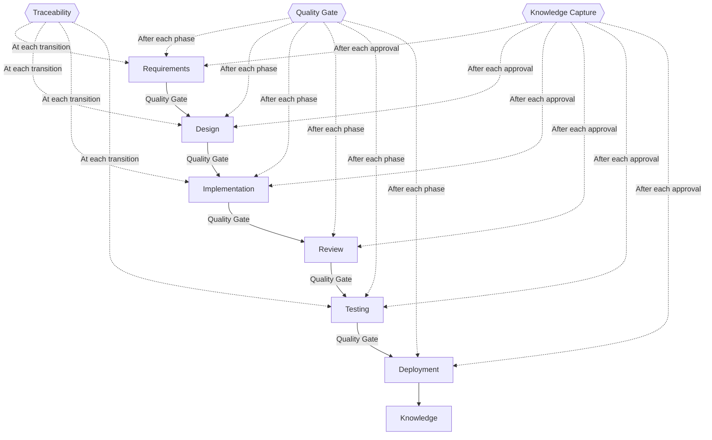

# V-Bounce SDLC Orchestrator v2.0

AI-Native Software Development Lifecycle framework with 9 specialized sub-agents.

Based on arXiv 2408.03416 (Hymel, 2024): AI handles implementation, humans shift to validators/verifiers.

## Core Principles (from paper)

1. **Quality Agent Pattern** — every phase output passes a quality gate before human review
2. **Continuous Test Creation** — test skeletons generated WITH requirements, not after
3. **Bounce Time Allocation** — minimize implementation time, maximize requirements/design/validation time
4. **Traceability by Design** — live REQ→Test→Code linking maintained at every phase
5. **Continuous Knowledge Capture** — learnings extracted after every phase, not just at end
6. **6-Activity Phase Anatomy** — structured cycle per phase (see below)

## Workflow Overview



**Additional tracks:** [Bugfix](references/workflows-bugfix-track.md) (6-phase, P2/P3), [Hotfix](references/workflows-hotfix-track.md) (5-phase, P0/P1), [Change Request](references/workflows-change-request-track.md) (4-phase, mid-cycle scope changes). The CR track applies when scope changes arrive during phases 3-7 of an active feature cycle.

## Sub-Agents

| Agent | Version | Trigger | Role |
|-------|---------|---------|------|
| **requirements** | v2.0.0 | "requirement", "PRD", "NFR" | Structured requirements + test skeletons |
| **design** | v2.0.0 | "design", "architecture" | Technical design + traceability update |
| **implementation** | v2.0.0 | "implement", "code" | Fast-track code generation |
| **review** | v1.2.0 | "review", "verify" | Hallucination detection + traceability check |
| **testing** | v2.0.0 | "test", "coverage" | Full tests + adaptive updates |
| **deployment** | v1.0.0 | "deploy", "release" | Deployment with approvals |
| **knowledge** | v2.0.0 | "retrospective", "lessons" | Per-phase + end-of-cycle capture |
| **quality-gate** | v1.0.0 | (automatic) | Per-phase quality checksum |
| **traceability** | v1.0.0 | "trace", "impact" | Live traceability matrix |

## 6-Activity Phase Anatomy

Every phase follows this structured cycle:

```
┌─────────────────────────────────────────────────────────────────┐
│  1. INPUT           Load context from previous phase            │
│  2. AI GENERATION   Phase agent produces output                 │
│  3. QUALITY GATE    quality-gate agent validates (PASS/WARN/FAIL)│
│  4. HUMAN REVIEW    User reviews (only if QG passes/warns ≤2)  │
│  5. REFINEMENT      Iterate if changes requested                │
│  6. APPROVAL +      User approves → traceability update +       │
│     KNOWLEDGE       knowledge capture                           │
└─────────────────────────────────────────────────────────────────┘
```

**Activity details**:

| # | Activity | Actor | Output |
|---|----------|-------|--------|
| 1 | Input | Orchestrator | Context from prior phase loaded |
| 2 | AI Generation | Phase sub-agent | Phase artifacts (requirements, design, code, etc.) |
| 3 | Quality Gate | quality-gate agent | PASS/WARN/FAIL verdict |
| 4 | Human Review | User | Feedback, change requests |
| 5 | Refinement | Phase sub-agent | Revised artifacts (loops back to step 3) |
| 6 | Approval + KC | User + knowledge agent + traceability agent | Phase approved, matrix updated, learnings captured |

If Quality Gate returns FAIL → loop back to step 2 (AI revises). No human review until QG passes.

## Bounce Time Enforcement

The paper's key insight: implementation should be FAST, validation should be DEEP.

| Phase | Time Allocation | Instruction |
|-------|----------------|-------------|
| **Requirements** | DEEP DIVE | Multiple refinement cycles expected. Ambiguity score must be < 50 for every requirement. Test skeletons generated alongside stories. |
| **Design** | DEEP DIVE | Architecture decisions documented via ADRs. Security design (STRIDE) mandatory. Traceability matrix updated. |
| **Implementation** | FAST TRACK | Generate code, verify packages, run quality gate, done. No over-engineering. No gold-plating. |
| **Review** | DEEP DIVE | Full hallucination check. Traceability verification. Security audit. |
| **Testing** | DEEP DIVE | Full test suite with 40/30/20/10 distribution. Every AC must have tests. Adaptive updates if requirements changed. |
| **Deployment** | STANDARD | Checklist-driven. Rollback plan mandatory. |

## Continuous Test Creation

During the **Requirements** phase:
1. Requirements agent generates user stories + acceptance criteria
2. Requirements agent ALSO generates test skeletons for each AC:
   - Test name: `Should_[AC outcome]_When_[AC condition]`
   - Test type: unit / integration / e2e
   - Linked AC: `AC-###`
   - Status: `skeleton` (no implementation yet)
3. These skeletons feed into the traceability matrix
4. During **Implementation**, skeletons are instantiated into real tests
5. During **Testing**, full test suite is validated against skeletons

## Continuous Knowledge Capture

After each phase approval, the knowledge agent performs a lightweight extraction:

| Phase | Knowledge Captured |
|-------|--------------------|
| Requirements | Ambiguity patterns found, clarification effectiveness, NFR gaps |
| Design | Architecture decision rationale, security findings, pattern reuse |
| Implementation | Hallucination patterns caught, package issues, code quality insights |
| Testing | Coverage gaps, edge case discovery patterns, test distribution balance |
| Review | Common issues found, false positive rate, review effectiveness |
| Deployment | Environment issues, configuration surprises, rollback triggers |

This is in ADDITION to the end-of-cycle retrospective that the knowledge agent performs.

## Traceability Integration

The traceability agent is invoked at each phase transition:

| Transition | Traceability Action |
|------------|-------------------|
| Requirements → Design | Initialize matrix: REQ→Story→AC→TestSkeleton |
| Design → Implementation | Update: add Component→API→Entity mappings |
| Implementation → Review | Update: add File→Function→Migration mappings |
| Testing → Deployment | Update: add Test→Result→Coverage mappings |
| On requirement change | Impact analysis: show all affected artifacts |
| On change request (CR) | CR assessment: classify impact (L1-L4), trace affected artifacts, produce delta plan. See [CR Workflow](references/workflows-change-request-track.md) |

## Approval Matrix

```yaml
approval_matrix:
  requirements:
    approvers: ["Product Owner", "Business Analyst"]
    quorum: 1

  design:
    approvers: ["Tech Lead", "Architect"]
    quorum: 1

  implementation:
    auto_review: required  # Must pass before human review
    approvers: ["Senior Developer", "Tech Lead"]
    quorum: 1

  testing:
    approvers: ["QA Lead"]
    quorum: 1

  deployment:
    staging:
      approvers: ["QA Lead"]
      quorum: 1
    production:
      approvers: ["Tech Lead", "Product Owner", "QA Lead"]
      quorum: 2  # Need 2 of 3
```

## Commands

| Command | Effect |
|---------|--------|
| `APPROVED` | Proceed to next phase (triggers KC + traceability update) |
| `APPROVED AS [ROLE]` | Approve with specific role |
| `CHANGES REQUESTED` | Revise current output (loops to step 5 in anatomy) |
| `SKIP TO [phase]` | Jump to phase (if prerequisites met) |
| `ROLLBACK TO [phase]` | Return to previous phase |
| `START CR [description]` | Pause feature cycle, create CR cycle, enter Assess phase |
| `APPROVED CR AS [L1-L4]` | Accept CR classification (L1-L3 → Replan, L4 → new cycle) |
| `CR REJECTED` | Deny CR, resume feature cycle unchanged |
| `CR DEFERRED` | Queue CR for future cycle, resume feature cycle |
| `CR SPLIT` | Split CR into smaller CRs assessed independently |
| `OVERRIDE CLASSIFICATION [L1-L4]` | Override CR classification (requires justification) |
| `CR RECONCILED` | Complete CR, merge overlay into traceability, resume feature |
| `ABORT CR` | Abandon CR, revert to pre-CR state |

## Quality Gates Summary

| Phase | Must Pass (enforced by quality-gate agent) |
|-------|-----------|
| Requirements | Ambiguity < 50, NFRs defined, stories have AC, test skeletons present |
| Design | Architecture complete, security design, API spec, traceability updated |
| Implementation | 0 hallucinations, all packages verified, tests present, design conformance |
| Testing | Distribution 40/30/20/10, all AC covered, edge cases present |
| Deployment | All tests pass, staging verified, rollback plan ready |

## State Management

```yaml
vbounce_state:
  cycle_id: "CYCLE-[PROJECT]-[YYYYMMDD]-[###]"
  current_phase: requirements | design | implementation | testing | deployment | knowledge
  phase_anatomy_step: input | generation | quality_gate | review | refinement | approval
  phases:
    requirements: { status: approved, approved_by: ["PO"], qg_verdict: pass, kc_captured: true }
    design: { status: approved, approved_by: ["Tech Lead"], qg_verdict: pass, kc_captured: true }
    implementation: { status: pending_review, auto_review: pass, qg_verdict: warn }
    testing: { status: not_started }
    deployment: { status: not_started }
    knowledge: { status: not_started }
  traceability:
    matrix_ref: "TM-[PROJECT]-[YYYYMMDD]"
    last_updated: "[Phase name]"
    orphan_count: 0
  change_requests:
    active: null  # Current CR being processed, or null
    queued: []    # CRs waiting (FIFO)
    completed: [] # Archived CR IDs
    # Example active CR:
    # active:
    #   cr_id: "CR-[PROJECT]-[YYYYMMDD]-[###]"
    #   classification: L2
    #   current_phase: replan
    #   feature_paused_at: implementation
```

## Integration with External Artifacts

V-Bounce quality-gate and traceability agents can validate existing project artifacts:
- Run quality-gate on requirements docs (requirements criteria) or design docs (design criteria)
- Run traceability on spec + plan + task files to build a coverage map

## Integration

Use Claude built-in skills for document generation:
- **docx**: PRD, deployment plans, reports
- **xlsx**: Traceability matrix, metrics, coverage
- **pptx**: Architecture presentations
