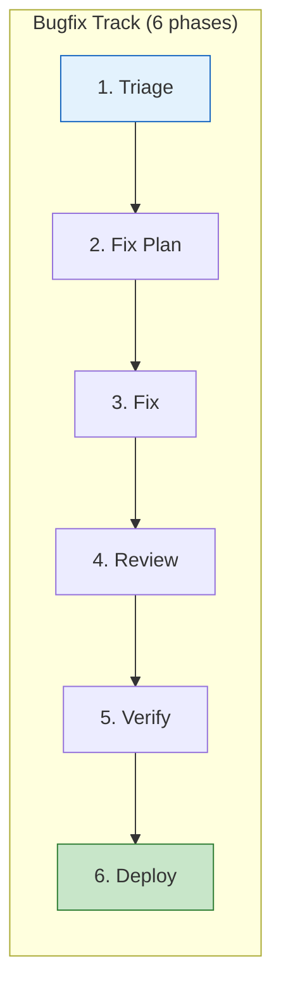
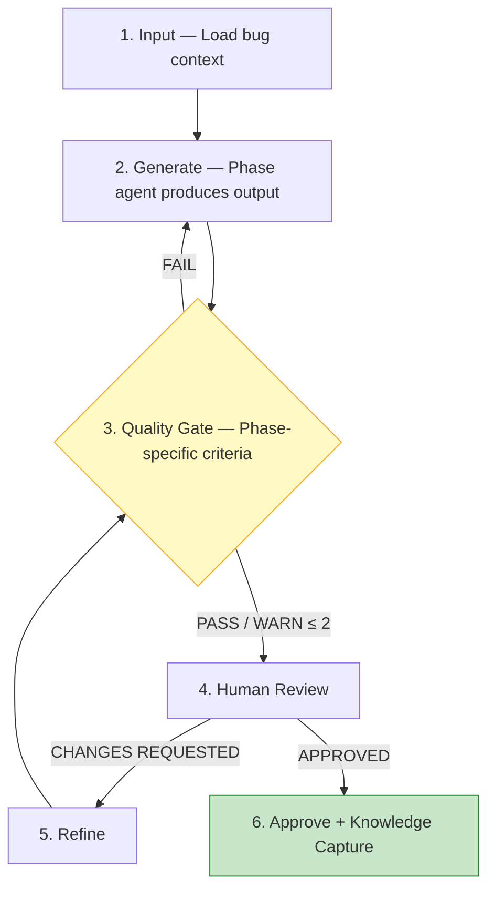
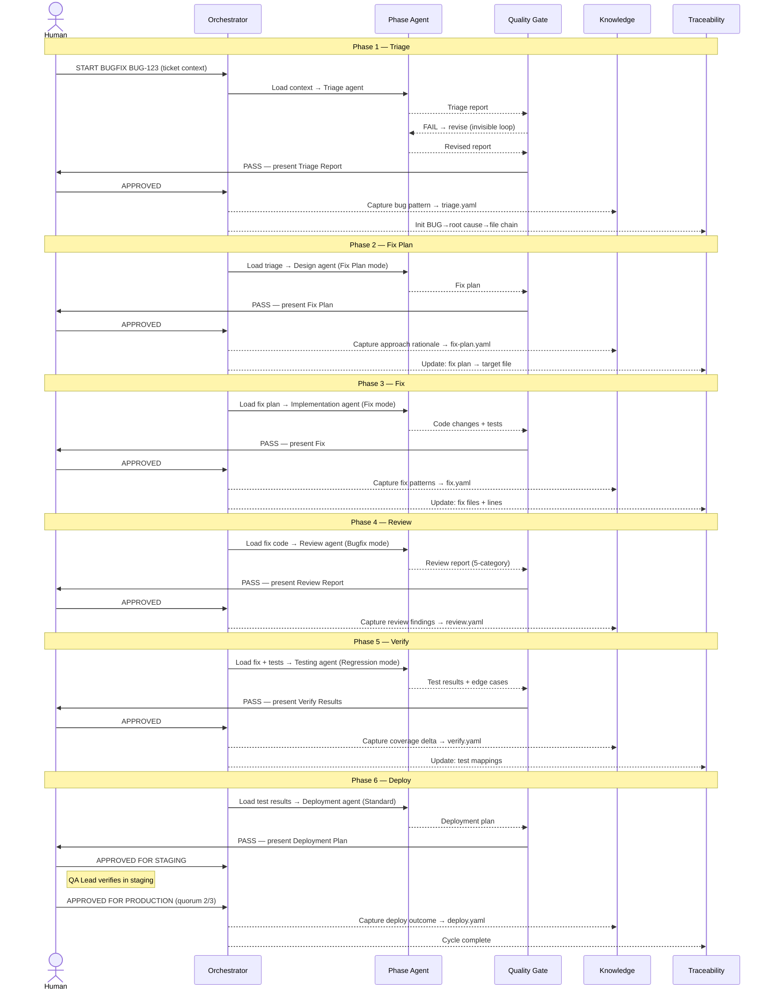
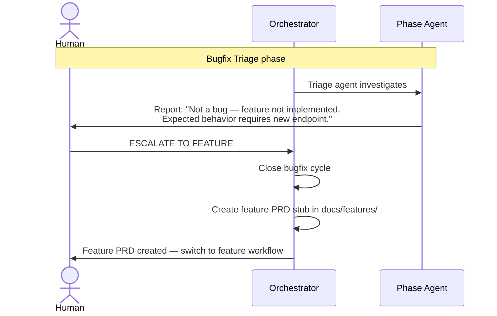

# V-Bounce Bugfix Workflow

> Workflow for non-urgent bugs (P2/P3) within the V-Bounce SDLC framework.
>
> **Version:** 1.0.0 | **Framework:** V-Bounce v2.0.0
> **See also:** [Hotfix Workflow](workflows-hotfix-track.md) for P0/P1 production incidents.

---

## 1. Overview

The feature workflow (7 phases, PRD-driven) is designed for greenfield development. Bugfixes differ fundamentally:

| Dimension | Feature | Bugfix |
|-----------|---------|--------|
| **Trigger** | Business need / PRD | QA finding / regression |
| **Input** | PRD in `docs/features/` | Bug ticket / test failure |
| **Time pressure** | Planned sprint | Normal priority |
| **Design needed** | Full architecture | Impact analysis only |
| **Phases** | 7 (Requirements → Deploy) | **6** (Triage → Deploy) |
| **Test scope** | Full 40/30/20/10 suite | Module regression + edge cases |
| **Prod approval** | 2/3 quorum | 2/3 quorum |

### Track Selection

| Priority | SLA | Track |
|----------|-----|-------|
| **P0** — System down | 4h to mitigate | [Hotfix](workflows-hotfix-track.md) |
| **P1** — Major degradation | 8h to mitigate | [Hotfix](workflows-hotfix-track.md) |
| **P2** — Minor issue | Next sprint | **Bugfix** (this doc) |
| **P3** — Cosmetic / low impact | Backlog | **Bugfix** (this doc) |

### Bugfix Flow



---

## 2. Phase Anatomy

Every phase follows a **6-activity cycle** adapted from the feature workflow:



- **FAIL** → agent revises (human never sees it)
- **WARN > 2** → agent revises and rechecks
- **WARN ≤ 2** → human review with warnings noted
- **PASS** → human review

---

## 3. Bugfix Track (6 Phases)

### 3.1 Triage Phase

Bounce time: **STANDARD** (reproduce and understand before acting)

Replaces the Requirements phase. Uses the `framework-reproduce-bug` skill as foundation.

| Step | Activity | Who | Does What | Output |
|------|----------|-----|-----------|--------|
| 1 | Input | Orchestrator | Loads bug ticket (title, description, steps-to-reproduce, stack trace, affected area) | Context ready |
| 2 | Generate | Agent: Triage | Parses signals, traces code path, forms hypothesis, writes failing regression test, scores confidence | Triage Report |
| 3 | QG | Agent: Quality Gate | Checks: reproduction confidence ≥ LIKELY, root cause identified, affected files listed, regression test present and failing, blast radius assessed | PASS / WARN / FAIL |
| 4 | Review | Person: SD or TL | Reviews root cause hypothesis, validates blast radius, confirms priority classification | Feedback |
| 5 | Refine | Agent: Triage | Adjusts hypothesis, rewrites test if needed → back to step 3 | Revised report |
| 6 | Approve | Person: SD or TL | Types `APPROVED` or `APPROVED AS [Role]` (quorum: 1 of 2) | Phase complete |
| 6a | KC | Agent: Knowledge | Captures bug pattern, root cause category, detection gap analysis | `triage.yaml` |

**Triage Report format:**

```yaml
triage_report:
  ticket_id: "BUG-###"
  title: "[Bug title]"
  priority: P2 | P3
  confidence: CONFIRMED | LIKELY | UNCONFIRMED | SKIPPED | ALREADY_FIXED

  root_cause:
    summary: "[1-2 sentences]"
    category: logic_error | data_handling | race_condition | configuration | integration | regression | missing_validation
    affected_files:
      - file: "path/to/file.py"
        lines: "XX-YY"
        issue: "[Description]"

  blast_radius:
    level: isolated | module | cross-module | system-wide
    affected_components: ["component1", "component2"]
    affected_apis: ["GET /endpoint"]
    downstream_impact: "[Description of cascading effects]"

  regression_test:
    file: "path/to/test_file.py"
    tests_failing: 1
    tests_passing: 1  # Happy path proves setup works

  fix_hint: "[Pseudocode or description of fix approach]"
```

**Approval:** 1 of [Senior Developer, Tech Lead]

**Confidence thresholds:**
- `CONFIRMED` or `LIKELY` → proceed to Fix Plan
- `UNCONFIRMED` after 3 attempts → escalate to human investigation
- `ALREADY_FIXED` → close ticket, capture knowledge
- `SKIPPED` → document blocker, reassign or defer

### 3.2 Fix Plan Phase

Bounce time: **STANDARD** (lightweight design — change impact only, not full architecture)

Only exists in bugfix track (hotfix skips this).

| Step | Activity | Who | Does What | Output |
|------|----------|-----|-----------|--------|
| 1 | Input | Orchestrator | Loads triage report, affected code, existing tests | Context ready |
| 2 | Generate | Agent: Design (Fix Plan mode) | Produces change impact analysis, fix approach (with alternatives), risk assessment, test plan | Fix Plan |
| 3 | QG | Agent: Quality Gate | Checks: root cause addressed (not symptom), blast radius contained, regression tests planned, no unnecessary changes | PASS / WARN / FAIL |
| 4 | Review | Person: SD or TL | Reviews fix approach, validates scope is minimal, confirms test plan | Feedback |
| 5 | Refine | Agent: Design | Adjusts approach per feedback → back to step 3 | Revised plan |
| 6 | Approve | Person: SD or TL | Types `APPROVED` (quorum: 1 of 2) | Phase complete |
| 6a | KC | Agent: Knowledge | Captures fix approach rationale, alternative approaches considered | `fix-plan.yaml` |

**Fix Plan format:**

```yaml
fix_plan:
  ticket_id: "BUG-###"
  approach:
    summary: "[1-2 sentences describing the fix]"
    changes:
      - file: "path/to/file.py"
        type: modify | add | delete
        description: "[What changes and why]"
    alternatives_considered:
      - approach: "[Alternative]"
        rejected_because: "[Reason]"

  scope_guard:
    max_files_changed: 5        # Alert if exceeded
    max_lines_changed: 100      # Alert if exceeded
    refactoring_included: false  # Must be false — fix only

  risk:
    regression_areas: ["area1", "area2"]
    mitigation: "[How regression risk is addressed]"

  test_plan:
    regression_tests: ["test_name_1", "test_name_2"]
    fix_verification: ["test_verify_fix"]
    edge_cases: ["test_edge_1"]
```

**Approval:** 1 of [Senior Developer, Tech Lead]

**Scope guard:** If `max_files_changed > 5` or `max_lines_changed > 100`, QG issues WARN — the fix may be too broad and should be split or escalated to a feature/refactor.

### 3.3 Fix Phase

Bounce time: **FAST TRACK** (implement the approved fix plan, nothing more)

Uses Implementation agent in fix mode.

| Step | Activity | Who | Does What | Output |
|------|----------|-----|-----------|--------|
| 1 | Input | Orchestrator | Loads fix plan, affected files, regression test from triage | Context ready |
| 2 | Generate | Agent: Implementation (Fix mode) | Implements fix per approved plan, updates regression test to pass, adds fix verification tests, verifies packages | Code changes + tests |
| 3 | QG | Agent: Quality Gate | Checks: regression test now passes, fix verification test passes, no hallucinated packages, scope within fix plan bounds, no unrelated changes | PASS / WARN / FAIL |
| 4 | Review | Person: SD or TL | Reviews code change, confirms minimal scope, checks test coverage | Feedback |
| 5 | Refine | Agent: Implementation | Fixes issues → back to step 3 | Revised code |
| 6 | Approve | Person: SD or TL | Types `APPROVED` (quorum: 1 of 2) | Phase complete |
| 6a | KC | Agent: Knowledge | Captures fix patterns, hallucination issues if any | `fix.yaml` |

**Approval:** 1 of [Senior Developer, Tech Lead]

**Scope enforcement:**
- Agent MUST NOT modify files not listed in the fix plan
- Agent MUST NOT add new dependencies unless fix plan explicitly requires it
- Agent MUST NOT refactor surrounding code ("while I'm here..." is forbidden)

### 3.4 Review Phase

Bounce time: **STANDARD** (focused review — regression risk is the primary concern)

Uses Review agent with bugfix-specific weighting.

| Step | Activity | Who | Does What | Output |
|------|----------|-----|-----------|--------|
| 1 | Input | Orchestrator | Loads fix code, triage report, fix plan, test results | Context ready |
| 2 | Generate | Agent: Review (Bugfix mode) | Runs 5-category review with bugfix weighting | Review report |
| 3 | QG | Agent: Quality Gate | Validates review completeness (all categories checked, all changed files reviewed) | PASS / WARN / FAIL |
| 4 | Review | Person: SD or TL | Reviews findings, confirms or disputes issues | Feedback |
| 5 | Refine | Agent: Review | Re-evaluates disputed findings → back to step 3 | Revised report |
| 6 | Approve | Person: SD or TL | Accepts verdict: APPROVE (≥ 80) / COMMENT (≥ 60) / REQUEST_CHANGES (< 60) | Phase complete |
| 6a | KC | Agent: Knowledge | Captures review findings, false positive rate | `review.yaml` |

**Bugfix review weighting:**

| Category | Weight | Rationale |
|----------|--------|-----------|
| Regression risk | **30%** | Primary risk in bugfixes |
| Hallucination detection | 20% | Still important for AI-generated fixes |
| Fix correctness | **20%** | Does the fix address root cause, not symptom? |
| Scope containment | **20%** | Is the change minimal and focused? |
| Test adequacy | 10% | Are regression + verification tests sufficient? |

**Verdict thresholds:**
- `regression_risk_score < 70` → REQUEST_CHANGES (critical)
- `scope_containment_score < 60` → REQUEST_CHANGES (fix too broad)
- `overall_score ≥ 80 AND no critical` → APPROVE
- `overall_score ≥ 60` → COMMENT (minor fixes)

**Approval:** 1 of [Senior Developer, Tech Lead]

### 3.5 Verify Phase

Bounce time: **STANDARD** (targeted test execution)

Uses Testing agent in regression mode.

| Step | Activity | Who | Does What | Output |
|------|----------|-----|-----------|--------|
| 1 | Input | Orchestrator | Loads fix code, regression test, affected test suites, blast radius from triage | Context ready |
| 2 | Generate | Agent: Testing (Regression mode) | Runs: (1) regression test passes, (2) fix verification tests pass, (3) existing tests in affected modules pass, (4) generates additional edge case tests for the fix | Test results |
| 3 | QG | Agent: Quality Gate | Checks: regression test passes, 0 test regressions in affected modules, fix verification covers the root cause, edge cases present (≥ 2) | PASS / WARN / FAIL |
| 4 | Review | Person: QA Lead or SD | Reviews test results, validates edge cases, confirms no regressions | Feedback |
| 5 | Refine | Agent: Testing | Adds missing tests → back to step 3 | Revised suite |
| 6 | Approve | Person: QA Lead or SD | Types `APPROVED` (quorum: 1 of 2) | Phase complete |
| 6a | KC | Agent: Knowledge | Captures test coverage delta, edge cases discovered | `verify.yaml` |

**Approval:** 1 of [QA Lead, Senior Developer]

**Test scope (regression mode):**
- Run regression test from triage (must now pass)
- Run fix verification tests (new tests proving the fix works)
- Run existing test suite for affected modules (must still pass)
- Generate ≥ 2 edge case tests around the fix boundary
- Do NOT run full 40/30/20/10 distribution — that's for feature work

### 3.6 Deploy Phase

Bounce time: **STANDARD** (normal deployment pipeline)

Uses Deployment agent with standard settings.

| Step | Activity | Who | Does What | Output |
|------|----------|-----|-----------|--------|
| 1 | Input | Orchestrator | Loads test results, deployment config, fix summary | Context ready |
| 2 | Generate | Agent: Deployment | Creates deployment plan with fix-specific rollback trigger: "if bug recurs within 1h, auto-rollback" | Deployment plan |
| 3 | QG | Agent: Quality Gate | Checks: all tests pass, rollback plan present, fix summary documented for changelog | PASS / WARN / FAIL |
| 4a | Review-Staging | Person: QA Lead | Verifies fix in staging, runs smoke tests | `APPROVED FOR STAGING` |
| 4b | Review-Prod | Person: TL + PO + QA | Reviews production readiness (quorum 2 of 3) | `APPROVED FOR PRODUCTION` |
| 5 | Refine | Agent: Deployment | Updates plan per feedback → back to step 3 | Revised plan |
| 6 | Approve | Person: TL + PO + QA | Types `APPROVED FOR PRODUCTION` (quorum: 2 of 3) | Deployment executed |
| 6a | KC | Agent: Knowledge | Captures deployment outcome, rollback events | `deploy.yaml` |

**Staging approval:** 1 of [QA Lead]
**Production approval:** 2 of 3 [Tech Lead, Product Owner, QA Lead]

---

## 4. Roles & Responsibilities

### Person Roles

| Phase | Tech Lead | Senior Dev | QA Lead | Product Owner |
|-------|-----------|-----------|---------|--------------|
| **Triage** | Approves | Approves | — | — |
| **Fix Plan** | Approves | Approves | — | — |
| **Fix** | Approves | Approves | — | — |
| **Review** | Approves | Approves | — | — |
| **Verify** | — | Approves | Approves | — |
| **Deploy-Staging** | — | — | Approves | — |
| **Deploy-Prod** | Approves (2/3) | — | Approves (2/3) | Approves (2/3) |

### Agent Roles

| Phase | Phase Agent | Quality Gate Checks | Knowledge Captures |
|-------|-----------|-------------|-----------|
| **Triage** | Triage (reproduce, root cause, failing test) | Reproduction confidence, root cause, test failing | Bug pattern, root cause category |
| **Fix Plan** | Design (Fix Plan mode): impact analysis, fix approach | Root cause addressed, scope contained, tests planned | Fix approach rationale |
| **Fix** | Implementation (Fix mode): minimal code change | Regression passes, scope within plan, no hallucinations | Fix patterns |
| **Review** | Review (Bugfix mode): 5-category, regression-weighted | Review completeness | Review findings |
| **Verify** | Testing (Regression mode): module regression + edge cases | Tests pass, no regressions | Coverage delta, edge cases |
| **Deploy** | Deployment (Standard mode) | Rollback plan, monitoring | Deployment outcome |

---

## 5. Quality Gate Criteria

| Phase | PASS | WARN | FAIL |
|-------|------|------|------|
| **Triage** | Confidence ≥ LIKELY, root cause identified, test failing, blast radius assessed | Confidence = LIKELY (not CONFIRMED), blast radius unclear | Confidence = UNCONFIRMED, no root cause, no failing test |
| **Fix Plan** | Root cause addressed, scope ≤ 5 files / ≤ 100 lines, tests planned | Scope slightly over limits (5-8 files or 100-150 lines) | Symptom-level fix, massive scope, no test plan |
| **Fix** | Regression test passes, scope matches plan, 0 hallucinated packages, no unrelated changes | Minor scope deviation (1 extra file) | Regression test still fails, hallucinated packages, scope violation |
| **Review** | Overall ≥ 80, no critical issues | Overall 60-79, minor issues | Overall < 60, regression risk critical, scope blown |
| **Verify** | Regression passes, fix verification passes, module tests pass, ≥ 2 edge cases | 1 edge case (instead of 2), minor test cleanup needed | Regression fails, module tests regressed, no fix verification |
| **Deploy** | All tests pass, rollback plan present, changelog documented | Minor documentation gap | Tests failing, no rollback plan |

---

## 6. State Management

```yaml
vbounce_bugfix_state:
  track: bugfix
  ticket_id: "BUG-###"
  priority: P2 | P3
  cycle_id: "BF-[PROJECT]-[YYYYMMDD]-[###]"
  current_phase: triage | fix_plan | fix | review | verify | deploy
  phase_anatomy_step: input | generation | quality_gate | review | refinement | approval | post_phase

  phases:
    triage:
      status: approved | pending | not_started
      confidence: CONFIRMED | LIKELY | UNCONFIRMED
      root_cause_category: logic_error | data_handling | race_condition | ...
      regression_test: "path/to/test.py"
      approved_by: ["TL"]
    fix_plan:
      status: approved | pending | not_started
      scope: { files: 3, lines: 45 }
      approved_by: ["SD"]
    fix:
      status: approved | pending | not_started
      scope_actual: { files: 2, lines: 30 }
      approved_by: ["SD"]
    review:
      status: approved | pending | not_started
      verdict: APPROVE | COMMENT | REQUEST_CHANGES
      scores:
        regression_risk: 90
        fix_correctness: 85
        hallucination: 95
    verify:
      status: approved | pending | not_started
      regression_pass: true
      module_tests_pass: true
      edge_cases_added: 3
    deploy:
      status: deployed | pending | not_started
      rollback_triggered: false

  knowledge:
    triage_captured: true
    fix_captured: true
```

---

## 7. Commands

All standard V-Bounce commands apply, plus bugfix-specific commands:

| Command | When to Use | Effect |
|---------|------------|--------|
| `START BUGFIX [ticket-id]` | Begin bugfix workflow | Creates bugfix cycle, enters Triage phase |
| `APPROVED` | Any phase | Standard approval (triggers KC) |
| `APPROVED AS [Role]` | Any phase | Role-specific approval for audit trail |
| `CHANGES REQUESTED` | Any phase | Loops to refinement |
| `APPROVED FOR STAGING` | Deploy phase | Approves staging deployment |
| `APPROVED FOR PRODUCTION` | Deploy phase | Approves production deployment |
| `SKIP TO [phase]` | Any phase (if prerequisites met) | Skip ahead |
| `ROLLBACK TO [phase]` | Any phase | Return to previous phase |
| `ESCALATE TO FEATURE` | Triage — bug is actually a missing feature | Exits bugfix, creates feature PRD |
| `CLOSE AS ALREADY_FIXED` | Triage — bug no longer reproduces | Closes ticket, captures knowledge |
| `CLOSE AS WONT_FIX` | Triage — behavior is acceptable | Closes ticket, documents rationale |

---

## 8. Anti-Patterns

| DON'T | DO | Why |
|-------|-----|-----|
| Skip triage and jump to coding | Always reproduce first with a failing test | Fixing without understanding causes whack-a-mole bugs |
| Fix the symptom, not the root cause | Trace to root cause, fix plan must address it | Symptom-level fixes recur or create new bugs |
| Include refactoring in a bugfix | Fix only — create follow-up ticket for refactoring | Bugfix scope creep increases regression risk |
| Skip knowledge capture because "it's just a bugfix" | Every bug pattern is valuable for future prevention | The best bugs are the ones you never see again |

---

## 9. Integration with Feature Workflow

### When Bugfix Blocks a Feature

1. **Pause** the feature workflow at current phase
2. **Start** bugfix workflow for the bug
3. **Complete** the bugfix workflow
4. **Resume** the feature workflow
5. **Update** feature traceability to reference the bugfix

### When Feature Causes a Bug

1. **Start** bugfix workflow
2. During review, **trace back** to the feature's test gaps
3. **Update** the feature's knowledge capture with the bug pattern
4. **Create** additional tests in the feature's test suite

### When Change Request Arrives During Active Bugfix

Change Requests (scope changes) do **not** apply to bugfix cycles. Bugfixes have a fixed scope: the bug ticket.

- If the bug scope changes (e.g., "while fixing this, we realized we need to also change X"), **restart triage** with the expanded context — do not use the CR track.
- If the scope change is unrelated to the bug, file it as a separate feature request or CR against the original feature cycle.
- See [Change Request Workflow](workflows-change-request-track.md) for CR handling in feature cycles.

### Traceability

Bugfix traceability is lighter than feature traceability:

| Feature Traceability | Bugfix Traceability |
|---------------------|---------------------|
| REQ → Story → AC → Component → API → File → Test | BUG → Root Cause → Fix → Regression Test → Verification Test |
| Full matrix maintained across 7 phases | Compact chain maintained across 6 phases |
| Orphan detection (REQ without test = FAIL) | Gap detection (bug without regression test = FAIL) |

```yaml
bugfix_traceability:
  ticket_id: "BUG-###"
  root_cause:
    file: "path/to/file.py"
    lines: "XX-YY"
    category: "logic_error"
  fix:
    files_changed:
      - file: "path/to/file.py"
        lines_changed: "XX-YY"
  tests:
    regression: "path/to/test_regression.py::test_name"
    verification:
      - "path/to/test_fix.py::test_verify_1"
      - "path/to/test_fix.py::test_verify_2"
    edge_cases:
      - "path/to/test_fix.py::test_edge_1"
      - "path/to/test_fix.py::test_edge_2"
  related_feature: "FEAT-###" | null
```

---

## 10. Practical Walkthrough

### What Is Automatic (Human Never Sees)

| Automatic Step | When | What |
|----------------|------|------|
| **QG → regenerate loop** | After every generation | If QG FAIL or WARN > 2, agent revises. Human only sees the version that passed. |
| **Knowledge capture** | After every `APPROVED` | Extracts bug pattern, root cause category, detection gaps → saved as YAML. |
| **Scope enforcement + package verification** | During Fix phase QG | Checks file/line limits (5 files, 100 lines) and verifies all packages are real. |
| **Traceability update** | After approval of Triage, Fix Plan, Fix, Verify | Updates BUG → Root Cause → Fix → Test chain. |

### Full Bugfix Walkthrough (BUG-123, P2)



#### Phase 1: Triage

**Human provides** bug ticket context:

```
HUMAN:  START BUGFIX BUG-123
        Title: User avatar not updating after profile save
        Description: When a user uploads a new avatar and clicks Save,
        the API returns 200 but the avatar URL in the response still
        points to the old image. Refreshing the page shows the new avatar.
        Steps to reproduce: 1) Upload avatar 2) Click Save 3) Check response
        Stack trace: None (no error, just stale data)
        Affected area: User Profile API
```

> **Invisible:** Orchestrator creates cycle BF-AIQ-20260227-001, loads bug context, Triage agent investigates and writes failing test, QG validates. If QG FAIL, agent revises — human never sees failed attempts.

**Agent presents** Triage Report (after QG PASS):

```yaml
triage_report:
  ticket_id: "BUG-123"
  title: "User avatar not updating after profile save"
  priority: P2
  confidence: CONFIRMED

  root_cause:
    summary: "Profile update command returns cached DTO instead of refreshed
              entity. The avatar_url is read from the command input DTO,
              not from the saved entity."
    category: data_handling
    affected_files:
      - file: "api/application/commands/update_profile.py"
        lines: "45-52"
        issue: "Returns input DTO avatar_url instead of saved entity avatar_url"

  blast_radius:
    level: isolated
    affected_components: ["ProfileService"]
    affected_apis: ["PUT /api/users/{id}/profile"]
    downstream_impact: "SPA shows stale avatar until refresh. No data corruption."

  regression_test:
    file: "api/application/commands/tests/test_update_profile.py"
    tests_failing: 1
    tests_passing: 1

  fix_hint: "After save, re-read entity from repository and build response
             DTO from the persisted entity."
```

**Human approves:**

```
HUMAN:  APPROVED
        (Root cause matches what I suspected. Blast radius is indeed isolated.)
```

#### Phase 2: Fix Plan

> **Invisible:** Design agent (Fix Plan mode) generates plan. QG checks: root cause addressed? scope contained? tests planned?

**Agent presents** Fix Plan (after QG PASS):

```yaml
fix_plan:
  ticket_id: "BUG-123"
  approach:
    summary: "After saving the profile entity, re-read from repository and
              construct response DTO from the persisted entity instead of
              the input DTO."
    changes:
      - file: "api/application/commands/update_profile.py"
        type: modify
        description: "Replace line 48 (return from input DTO) with entity
                      reload + DTO construction"
    alternatives_considered:
      - approach: "Invalidate cache and return input DTO with new avatar URL"
        rejected_because: "Treats symptom, not root cause. Other fields
                           could also be stale."

  scope_guard:
    max_files_changed: 1
    max_lines_changed: 8
    refactoring_included: false

  risk:
    regression_areas: ["profile update", "avatar display"]
    mitigation: "Regression test from triage + existing profile test suite"

  test_plan:
    regression_tests: ["test_avatar_url_updated_in_response"]
    fix_verification: ["test_response_reflects_persisted_state"]
    edge_cases: ["test_concurrent_profile_updates"]
```

**Human approves:**

```
HUMAN:  APPROVED
        (Clean approach. 1 file, 8 lines — exactly right.)
```

#### Phases 3-6: Fix → Review → Verify → Deploy

> Same interaction pattern: invisible QG → agent presents → human approves → invisible KC + traceability. Compressed to show only agent output.

**Phase 3 — Fix** (Implementation agent, Fix mode):

```
Changes: update_profile.py (lines 45-52) — re-reads entity via
  repository.get() instead of returning input DTO
Tests: regression NOW PASSES + 2 new verification tests
Scope: 1 file, 6 lines (within plan: 1/8). 0 new packages.
```

**Phase 4 — Review** (Review agent, Bugfix mode):

```
Scores (bugfix weighting):
  Regression risk:   95/100 (30%) — isolated change, no side effects
  Hallucination:     100/100 (20%) — no new packages
  Fix correctness:   90/100 (20%) — addresses root cause, not symptom
  Scope containment: 100/100 (20%) — 1/5 files, 6/100 lines
  Test adequacy:     85/100 (10%) — 2 new tests + regression
Overall: 96.0 → APPROVE. Critical: 0.
```

**Phase 5 — Verify** (Testing agent, Regression mode):

```
Module regression: 23/23 PASS
Fix verification: PASSES (stale data no longer returned)
Edge cases generated: 2 new (concurrent update, null entity)
```

**Phase 6 — Deploy** (Deployment agent, Standard mode):

```
Deploy plan for BUG-123: 1 file, 6 lines
Pre-deploy: [x] All tests pass  [x] Rollback: revert commit
Staging: Awaiting APPROVED FOR STAGING
Production: Requires 2/3 quorum (TL + PO + QA)
```

**Bugfix summary:** 6 human touchpoints (1 per phase). Each requires `APPROVED` or a deployment-specific command. Typical flow completes in 1-2 review cycles per phase.

### Escalation: Bugfix → Feature

Triggered when a "bug" turns out to be missing functionality.



```
AGENT (Triage):
        triage_report:
          ticket_id: "BUG-789"
          confidence: SKIPPED
          root_cause:
            summary: "This is not a bug. The user expects bulk export
                      functionality that was never implemented."
            category: missing_feature
          recommendation: "Escalate to feature workflow."
```

```
HUMAN:  ESCALATE TO FEATURE
        (Agreed — this needs proper feature planning, not a fix.)
```

```
AGENT:  Bugfix BF-AIQ-20260227-003 closed.
        Created docs/features/XXX-bulk-export/prd/prd.md (stub).
        Switch to feature workflow for the new PRD
```

> If a hotfix exceeds scope limits and needs to escalate to bugfix, see [Hotfix Workflow — Escalation](workflows-hotfix-track.md#escalation-hotfix--bugfix).
