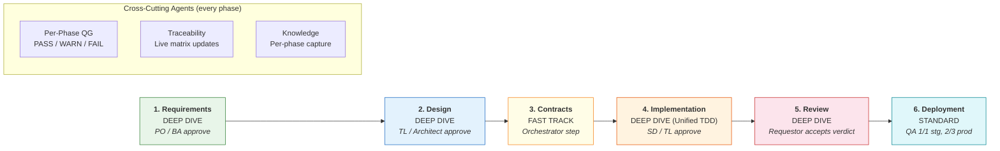
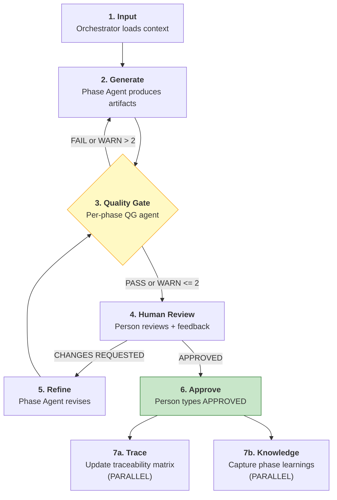

# V-Bounce Workflows by Role

> Quick-reference for who does what at each phase of the V-Bounce SDLC framework.
>
> **Version:** 2.0.0 | **Framework:** V-Bounce v5.1.0

---

## 0. High-Level Workflow

### Pipeline Overview

Six phases flow left-to-right. Bounce time labels indicate how much iteration each phase expects. Cross-cutting agents (Per-Phase QG, Traceability, Knowledge) run at every phase.

### Phase Anatomy (7-Activity Loop)

Every phase follows the same internal structure. The Quality Gate acts as a gatekeeper between AI generation and human review -- humans never see FAIL-state output.

---

## 1. Master Swimlane

One-page overview. Rows = phases, columns = roles. Cell = what they do.

### Person Roles

| Phase | Product Owner | Business Analyst | Tech Lead | Architect | Senior Developer | QA Lead |
|-------|--------------|-----------------|-----------|-----------|-----------------|---------|
| **Requirements** | Reviews PRD, stories, ACs. Approves (quorum 1/2) | Reviews PRD, stories, ACs. Approves (quorum 1/2) | -- | -- | -- | -- |
| **Design** | -- | -- | Reviews architecture, APIs, ADRs. Approves (quorum 1/2) | Reviews architecture, security, data model. Approves (quorum 1/2) | -- | -- |
| **Implementation** | -- | -- | Reviews code + tests, design conformance. Approves (quorum 1/2) | -- | Reviews code + tests, packages. Approves (quorum 1/2) | -- |
| **Review** | -- | -- | -- | -- | -- | -- |
| **Deployment-Staging** | -- | -- | -- | -- | -- | Approves staging (quorum 1/1) |
| **Deployment-Prod** | Approves production (quorum 2/3) | -- | Approves production (quorum 2/3) | -- | -- | Approves production (quorum 2/3) |

### Agent Roles

> **Note:** Contracts (phase 3) is an orchestrator step, not an agent phase. It does not have a dedicated agent.

| Phase | Phase Agent | Quality Gate | Traceability | Knowledge |
|-------|------------|-------------|-------------|-----------|
| **Requirements** | Generates PRD, stories, ACs, NFRs, test skeletons | qg-requirements: ambiguity < 50, NFR coverage, testability | Initializes REQ-Story-AC-TSK matrix | Captures ambiguity patterns, NFR gaps |
| **Design** | Generates architecture, security (STRIDE), APIs, data model, ADRs | qg-design: REQ coverage, security completeness, API-story mapping | Updates matrix: Component, API, Entity mappings | Captures architecture decisions, security findings |
| **Implementation** | Unified TDD: writes tests from contracts (RED), implements code (GREEN), executes and verifies (max 3 iterations). Distribution: 40/20/10/10/10/10 | qg-implementation: 0 hallucinations, contract conformance, test distribution, V-Model levels, execution results | Updates matrix: File, Function, Migration + Test, Result, Coverage mappings | Captures hallucination patterns, package issues, coverage gaps |
| **Review** | Runs hallucination detection, security audit, test-source cross-check, contract conformance, execution report review | -- (Review IS the deep check) | Validates matrix completeness, design conformance | Captures common issues, false positive rate |
| **Deployment** | Creates deployment plan, rollback plan, runs checklists | qg-deployment: rollback plan, monitoring alerts, acceptance verification | -- | Captures environment issues, rollback triggers |

---

## 2. Per-Phase Workflow Tables

Each phase follows the **7-Activity Anatomy**. Steps 7a and 7b are sub-steps of Post-Phase that run in parallel after Approval.

**QG branching rules:**
- **FAIL** --> back to step 2 (agent revises, human never sees it)
- **WARN > 2** --> back to step 2 (revise and recheck)
- **WARN <= 2** --> proceed to step 4 (human review, with warnings noted)
- **PASS** --> proceed to step 4 (human review)

### 2.1 Requirements Phase

Bounce time: **DEEP DIVE** (multiple refinement cycles expected)

| Step | Activity | Who | Does What | Output |
|------|----------|-----|-----------|--------|
| 1 | Input | Orchestrator | Loads PRD from `{workspace}/prd.md` | Context ready |
| 2 | Generate | Agent: Requirements | Parses PRD, detects ambiguities, generates stories + ACs + NFRs + test skeletons | YAML artifacts |
| 3 | QG | Agent: qg-requirements | Checks: ambiguity < 50 per REQ, NFR coverage (4 categories), AC testability (GIVEN-WHEN-THEN), story independence, traceability completeness | PASS / WARN / FAIL |
| 4 | Review | Person: PO or BA | Reviews stories, ACs, NFRs. Checks business goals and measurable metrics | Feedback |
| 5 | Refine | Agent: Requirements | Revises per feedback, re-scores ambiguity, updates test skeletons --> back to step 3 | Revised artifacts |
| 6 | Approve | Person: PO or BA | Types `APPROVED` or `APPROVED AS [Role]` (quorum: 1 of 2) | Phase complete |
| 7a | Trace | Agent: Traceability | Initializes matrix: REQ --> Story --> AC --> TestSkeleton | `traceability.yaml` |
| 7b | KC | Agent: Knowledge | Captures ambiguity patterns, clarification effectiveness, NFR gaps | `requirements.yaml` |

**Approval:** 1 of [Product Owner, Business Analyst]

### 2.2 Design Phase

Bounce time: **DEEP DIVE** (architecture decisions require thorough validation)

| Step | Activity | Who | Does What | Output |
|------|----------|-----|-----------|--------|
| 1 | Input | Orchestrator | Loads approved requirements, knowledge base patterns | Context ready |
| 2 | Generate | Agent: Design | Designs architecture, security (STRIDE), APIs, data model, ADRs. Updates traceability | YAML artifacts |
| 3 | QG | Agent: qg-design | Checks: 1:1 REQ coverage, STRIDE + auth + data protection present, 100% story-to-API mapping, data model integrity, ADR presence, diagram accuracy | PASS / WARN / FAIL |
| 4 | Review | Person: TL or Architect | Reviews architecture fit, security model, API design, scalability plan | Feedback |
| 5 | Refine | Agent: Design | Revises architecture, updates ADRs, re-maps traceability --> back to step 3 | Revised artifacts |
| 6 | Approve | Person: TL or Architect | Types `APPROVED` or `APPROVED AS [Role]` (quorum: 1 of 2) | Phase complete |
| 7a | Trace | Agent: Traceability | Updates matrix: REQ --> Component, REQ --> API endpoint, Story --> Data entity | `traceability.yaml` updated |
| 7b | KC | Agent: Knowledge | Captures architecture decisions, security findings, pattern reuse opportunities | `design.yaml` |

**Approval:** 1 of [Tech Lead, Architect]

### 2.3 Contracts Phase

Bounce time: **FAST TRACK** (orchestrator step -- generates shared API contracts from approved design)

| Step | Activity | Who | Does What | Output |
|------|----------|-----|-----------|--------|
| 1 | Input | Orchestrator | Loads approved design artifacts (APIs, data model, interfaces) | Context ready |
| 2 | Generate | Orchestrator | Generates shared API contracts (TypeScript interfaces, request/response types, error codes, endpoint signatures) from approved design | Contract files |
| 3 | Validate | Orchestrator | Checks: 100% API coverage, type completeness, consistency with design, no orphan types | Validated |
| 4 | Update State | Orchestrator | Sets `phases.contracts.status: generated`, proceeds to Implementation | Phase complete |

**Note:** Automated orchestrator step — no human approval gate. The orchestrator generates contracts that become the shared source of truth for the unified TDD implementation.

### 2.4 Implementation Phase (Unified TDD)

Bounce time: **DEEP DIVE** (unified TDD: tests + code + execution in one agent)

| Step | Activity | Who | Does What | Output |
|------|----------|-----|-----------|--------|
| 1 | Input | Orchestrator | Loads contracts, requirements, design, tech context, knowledge base | Context ready |
| 2 | Generate | Agent: Implementation | Unified TDD: writes tests from contracts (RED), implements code to pass them (GREEN), executes install → compile → test with up to 3 fix iterations. Verifies all packages | Code + tests + execution report |
| 3 | QG | Agent: qg-implementation | Checks: 0 hallucinations, contract conformance, file size, test distribution (40/20/10/10/10/10), V-Model levels, AC coverage, design spec compliance, execution results | PASS / WARN / FAIL |
| 4 | Review | Person: SD or TL | Reviews code quality, test coverage, design conformance, package choices | Feedback |
| 5 | Refine | Agent: Implementation | Fixes issues, re-verifies packages, re-executes --> back to step 3 | Revised code + tests |
| 6 | Approve | Person: SD or TL | Types `APPROVED` or `APPROVED AS [Role]` (quorum: 1 of 2) | Phase complete |
| 7a | Trace | Agent: Traceability | Updates matrix: Component --> File, API --> Route handler, Entity --> Migration, AC --> Test case | `traceability.yaml` updated |
| 7b | KC | Agent: Knowledge | Captures hallucination patterns, package issues, coverage gaps, edge case patterns | `implementation.yaml` |

**Prerequisite:** `auto_review: required` -- must pass before human review.
**Approval:** 1 of [Senior Developer, Tech Lead]
**Test distribution:** 40% positive / 20% negative / 10% edge / 10% security / 10% component-integration / 10% system-E2E
**Test distribution tolerance:** within 5% = PASS, within 10% = WARN, beyond 10% = FAIL

### 2.5 Review Phase

Bounce time: **DEEP DIVE** (full hallucination check, security audit, test-source cross-check)

| Step | Activity | Who | Does What | Output |
|------|----------|-----|-----------|--------|
| 1 | Input | Orchestrator | Loads implementation artifacts, traceability matrix, contracts | Context ready |
| 2 | Generate | Agent: Review | Runs 5-category review: hallucination (30%), security (25%), code quality (20%), logic (15%), performance (10%). Checks contract conformance, test-source cross-check, and execution report | Review report |
| 3 | QG | -- | No separate QG — review IS the deep check | -- |
| 4 | Review | Person: (Requestor) | Reviews findings, confirms or disputes issues | Feedback |
| 5 | Refine | Agent: Review | Re-evaluates disputed findings, adjusts scores --> back to step 4 | Revised report |
| 6 | Approve | Person: (Requestor) | Accepts review verdict: APPROVE (>= 80), COMMENT (>= 60), or REQUEST_CHANGES (< 60) | Phase complete |
| 7a | Trace | Agent: Traceability | Validates: unmapped files, unimplemented requirements, design conformance | Validation report |
| 7b | KC | Agent: Knowledge | Captures common issues, false positive rate, review effectiveness | `review.yaml` |

**Verdict thresholds:**
- `hallucination_score < 80` --> REQUEST_CHANGES (critical)
- `security_score < 70` --> REQUEST_CHANGES
- `traceability_check = fail` --> REQUEST_CHANGES
- `contract_conformance = fail` --> REQUEST_CHANGES
- `overall_score >= 80 AND no critical` --> APPROVE
- `overall_score >= 60` --> COMMENT (minor fixes)

### 2.6 Deployment Phase

Bounce time: **STANDARD** (checklist-driven)

| Step | Activity | Who | Does What | Output |
|------|----------|-----|-----------|--------|
| 1 | Input | Orchestrator | Loads test report, execution report, deployment config, rollback templates | Context ready |
| 2 | Generate | Agent: Deployment | Creates deployment plan, rollback plan (with trigger conditions), pre-deployment checklist | Deployment artifacts |
| 3 | QG | Agent: qg-deployment | Checks: checklist 100% complete, rollback plan present + tested, monitoring alerts configured (>= 2), breaking changes documented, env vars documented | PASS / WARN / FAIL |
| 4a | Review-Staging | Person: QA Lead | Reviews staging deployment, runs smoke tests | `APPROVED FOR STAGING` |
| 4b | Review-Prod | Person: TL + PO + QA | Reviews production readiness (quorum 2 of 3) | `APPROVED FOR PRODUCTION` |
| 5 | Refine | Agent: Deployment | Updates plan per feedback --> back to step 3 | Revised plan |
| 6 | Approve | Person: TL + PO + QA | Types `APPROVED FOR PRODUCTION` (quorum: 2 of 3) | Deployment executed |
| 7a | Monitor | Agent: Deployment | Post-deploy health checks, 24h monitoring. Rollback if: error rate > 1%, p95 latency > 500ms, health check failures > 3 | Monitoring report |
| 7b | KC | Agent: Knowledge | Captures environment issues, configuration surprises, rollback triggers | `deployment.yaml` |

**Staging approval:** 1 of [QA Lead]
**Production approval:** 2 of 3 [Tech Lead, Product Owner, QA Lead]

---

## 3. Role Quick-Reference Cards

### Person Roles

#### Product Owner (PO)

- **Active in:** Requirements (reviewer + approver), Deployment-Prod (approver)
- **Reviews:** PRD, user stories, acceptance criteria, NFRs, success metrics
- **Approves:** Requirements phase (quorum 1/2), Production deployment (quorum 2/3)
- **Commands:** `APPROVED`, `APPROVED AS Product Owner`, `CHANGES REQUESTED`, `APPROVED FOR PRODUCTION`
- **Key check:** Are business goals met? Are success metrics measurable? Do ACs reflect user value?

#### Business Analyst (BA)

- **Active in:** Requirements (reviewer + approver)
- **Reviews:** PRD completeness, user stories, acceptance criteria, NFR categories
- **Approves:** Requirements phase (quorum 1/2)
- **Commands:** `APPROVED`, `APPROVED AS Business Analyst`, `CHANGES REQUESTED`
- **Key check:** Are requirements unambiguous? Are edge cases captured? Is scope well-bounded?

#### Tech Lead (TL)

- **Active in:** Design (reviewer + approver), Implementation (reviewer + approver), Deployment-Prod (approver)
- **Reviews:** Architecture decisions, API design, code + test quality, design conformance
- **Approves:** Design phase (quorum 1/2), Implementation phase (quorum 1/2), Production deployment (quorum 2/3)
- **Commands:** `APPROVED`, `APPROVED AS Tech Lead`, `CHANGES REQUESTED`, `APPROVED FOR PRODUCTION`
- **Key check:** Does design fit the system? Is code maintainable? Are there security gaps?

#### Architect (ARC)

- **Active in:** Design (reviewer + approver)
- **Reviews:** Architecture style, component boundaries, security model (STRIDE), scalability plan, data model
- **Approves:** Design phase (quorum 1/2)
- **Commands:** `APPROVED`, `APPROVED AS Architect`, `CHANGES REQUESTED`
- **Key check:** Is architecture consistent with existing system? Are trade-offs documented in ADRs?

#### Senior Developer (SD)

- **Active in:** Implementation (reviewer + approver)
- **Reviews:** Code quality, test quality, package choices, coding standards compliance
- **Approves:** Implementation phase (quorum 1/2)
- **Commands:** `APPROVED`, `APPROVED AS Senior Developer`, `CHANGES REQUESTED`
- **Key check:** Is code clean? Are all packages verified (no hallucinations)? Do tests pass? Is test coverage adequate?

#### QA Lead (QA)

- **Active in:** Deployment-Staging (approver), Deployment-Prod (approver)
- **Reviews:** Test report, coverage matrix, deployment readiness
- **Approves:** Staging deployment (quorum 1/1), Production deployment (quorum 2/3)
- **Commands:** `APPROVED`, `APPROVED AS QA Lead`, `CHANGES REQUESTED`, `APPROVED FOR STAGING`, `APPROVED FOR PRODUCTION`
- **Key check:** Does every AC have a test? Is test distribution balanced? Is deployment safe?

### Agent Roles

#### Requirements Agent

- **Active in:** Requirements (step 2 + 5)
- **Input:** PRD from `{workspace}/prd.md`
- **Output:** Structured requirements (stories, ACs, NFRs, test skeletons, ambiguity scores)
- **Key rule:** Every AC must be GIVEN-WHEN-THEN. Every requirement scored for ambiguity (must be < 50). Test skeletons generated alongside requirements (continuous test creation).
- **Process:** Parse --> Detect Ambiguities --> Generate PRD --> Create Stories --> Define NFRs --> Write ACs --> Generate Test Skeletons --> Build Traceability --> Score Ambiguity

#### Design Agent

- **Active in:** Design (step 2 + 5)
- **Input:** Approved requirements + knowledge base patterns
- **Output:** Architecture, security design (STRIDE), APIs, data model, ADRs, traceability update
- **Key rule:** Must consult knowledge base first (lessons learned, code patterns). Every story must map to API endpoint(s). STRIDE threat model mandatory. Frontend/UI design if project has frontend.
- **Process:** Consult KB --> Analyze REQs --> Design Architecture --> Design Security --> Design APIs --> Create Data Model --> Plan Scalability --> Document ADRs --> Update Traceability --> Preview Test Impact

#### Implementation Agent (Unified TDD)

- **Active in:** Implementation (step 2 + 5)
- **Input:** Contracts + requirements + design + tech context + knowledge base
- **Output:** Source code + test suite + execution report (5 workspace files + project code + tests)
- **Key rule:** Unified TDD mode: write tests from contracts (RED), implement code to pass them (GREEN), execute install → compile → test with up to 3 fix iterations. Zero hallucinations. All packages verified. Supports parallel mode with scope restriction.
- **Process:** Consult KB --> Check Scope --> Inventory Contracts --> Verify Packages --> Write Tests (RED) --> Write Code (GREEN) --> Execute Install --> Execute Compile --> Execute Test --> Fix Loop --> Write Outputs --> Self-Verify

#### Review Agent

- **Active in:** Review (step 2 + 5)
- **Input:** Implementation artifacts, traceability matrix, contracts
- **Output:** Review report with scores (hallucination 30%, security 25%, code quality 20%, logic 15%, performance 10%)
- **Key rule:** Primary mission is catching AI hallucinations. Checks test-source cross-check (every method called in tests must exist in source). No separate QG — review IS the deep check.
- **Verdict:** APPROVE (>= 80, no critical) / COMMENT (>= 60) / REQUEST_CHANGES (< 60 or critical failures)

#### Deployment Agent

- **Active in:** Deployment (step 2 + 5 + 7a)
- **Input:** Test report, coverage matrix, execution report, deployment config
- **Output:** Deployment plan, rollback plan, post-deployment monitoring (24h)
- **Key rule:** Rollback plan mandatory with quantitative trigger conditions (error rate > 1%, p95 > 500ms, health check failures > 3). Strategies: Blue-Green, Canary, Rolling, Recreate.
- **Environments:** Dev (auto-deploy), Staging (QA approval), Production (2/3 quorum)

#### Knowledge Agent

- **Active in:** Every phase (step 7b, per-phase capture), end-of-cycle retrospective (post-phase agent)
- **Input:** Phase output artifacts
- **Output:** Per-phase: `[phase].yaml` capture. End-of-cycle: lessons (LL-*), code patterns (PAT-CODE-*), prompt patterns (PAT-PROMPT-*), AI effectiveness metrics
- **Key rule:** Two modes: per-phase capture (lightweight, after each approval) and end-of-cycle retrospective (full, after all phases). Tracks AI acceptance rate, hallucination rate, cycle time, test coverage, bounce ratio.

#### Per-Phase QG Agents (4 agents)

- **Active in:** Requirements (qg-requirements), Design (qg-design), Implementation (qg-implementation), Deployment (qg-deployment)
- **Input:** Phase artifacts + context references
- **Output:** Verdict (PASS / WARN / FAIL) with detailed per-criterion results
- **Key rule:** Only check, never generate. Domain-specific criteria per phase. If FAIL --> phase agent revises (human never sees it). If WARN > 2 --> revise. If WARN <= 2 or PASS --> proceed to human review.

#### Traceability Agent

- **Active in:** Requirements (step 7a, initialize), Design + Implementation (step 7a, update), Review (step 7a, validate), On-change (impact analysis)
- **Input:** Phase artifacts + existing matrix
- **Output:** Updated `traceability.yaml` with live REQ-to-Test-to-Code linking
- **Four modes:** Initialize (REQ phase), Update (DES/IMP phases), Validate (any phase), Finalize (after deployment), Impact Analysis (on change)
- **Orphan detection:** REQ without Story = FAIL, Story without AC = FAIL, AC without Test = WARN (REQ phase) / FAIL (IMP phase), Test without AC = WARN, Component without REQ = WARN, File without Component = WARN

---

## 4. Anti-Patterns

| DON'T | DO | Why |
|-------|-----|-----|
| Skip Quality Gate to save time | Always let QG run before human review | Catches issues before a human wastes time reviewing flawed output |
| Let humans review after a QG FAIL | Agent revises until QG passes, THEN human reviews | Human time is the bottleneck -- don't waste it on known-bad output |
| Gold-plate during Implementation | Unified TDD: write tests, implement contracts, verify, done | Bounce pattern allocates deep time to implementation now that it includes testing + execution |
| Write full tests during Requirements | Generate test SKELETONS only (status: skeleton); full tests come from contracts in Implementation (TDD-RED) | Full test bodies come during Implementation phase and are validated via execution |
| Skip ambiguity scoring | Score every requirement 0-100, block if >= 51 | Ambiguous requirements cascade into design/code/test defects |
| Approve without role declaration | Always type `APPROVED AS [Role]` | Traceability needs to know WHO approved for audit trail |
| Manually track requirement-to-code links | Let Traceability Agent maintain the live matrix | Manual tracking drifts; agent updates at every phase transition |
| Skip per-phase Knowledge Capture | Let KC agent run after every phase approval | End-of-cycle retrospective alone misses phase-specific context |
| Invent package names in Implementation | Verify every dependency: `npm view`, `pip index`, `dotnet package search` | Hallucinated packages are the #1 AI code generation failure mode |
| Deploy without a rollback plan | Rollback plan with quantitative triggers is mandatory | "We'll figure it out" is not a rollback plan |
| Approve production with 1 person | Require 2 of 3 quorum (TL + PO + QA Lead) | Production risk requires cross-functional sign-off |
| Re-run Review checks that QG already passed | Review agent skips QG-covered checks (package verification, file size) | Avoid duplicate work; Review focuses on hallucination, security, logic, performance, contract conformance |
| Treat WARN as PASS | WARN > 2 loops back to revision; WARN <= 2 proceeds with warnings noted | Accumulated warnings indicate systemic issues that compound across phases |
| Separate test generation from implementation | Unified TDD: one agent writes tests + code + executes | Separate agents cause contract mismatch — the #1 v5.0 failure mode |
| Skip execution verification | Implementation agent runs install, compile, test internally | Without execution verification, Review operates on unvalidated code |

---

## 5. Command Reference

| Command | When to Use | Effect |
|---------|------------|--------|
| `APPROVED` | Any phase, generic approval | Proceeds to next phase; triggers KC + Traceability |
| `APPROVED AS [Role]` | Any phase, role-specific approval | Same as APPROVED but records approver role for audit trail |
| `CHANGES REQUESTED` | Any phase, during review | Loops to step 5 (Refinement), agent revises per feedback |
| `SKIP TO [phase]` | When prerequisites are already met | Jumps to named phase (validates prerequisites first) |
| `ROLLBACK TO [phase]` | When a later phase reveals earlier issues | Returns to named phase, preserving work done so far |
| `APPROVED FOR STAGING` | Deployment phase | Approves staging deployment (QA Lead, quorum 1/1) |
| `APPROVED FOR PRODUCTION` | Deployment phase | Approves production deployment (quorum 2/3: TL + PO + QA Lead) |
| `START CR [description]` | Scope change during active feature cycle | Pauses feature cycle, creates CR cycle, enters Assess phase |
| `APPROVED CR AS [L1-L4]` | CR Assess phase | Accepts CR classification and proceeds to Replan (L1-L3) or new cycle (L4) |
| `CR REJECTED` | CR Assess phase | CR denied, feature cycle resumes unchanged |
| `CR DEFERRED` | CR Assess phase | CR queued for future cycle, feature cycle resumes |
| `CR SPLIT` | CR Assess phase | CR split into smaller CRs, each assessed independently |
| `OVERRIDE CLASSIFICATION [L1-L4]` | CR Assess or Re-execute phase | Human overrides CR classification (must provide justification) |
| `CR RECONCILED` | CR Reconcile phase | CR complete, overlay merged into traceability, feature resumes |
| `ABORT CR` | Any CR phase | Abandons CR, reverts to pre-CR state, feature cycle resumes |

---

## 6. Change Request Integration

When a scope change arrives **during an active feature cycle** (after requirements are approved, phases 3-6), the [Change Request Workflow](workflows-change-request-track.md) applies.

### When CRs Apply

- Feature cycle must be in phases 3-6 (Contracts through Deployment)
- The change is externally sourced (stakeholder, customer, market shift)
- The change is not a bug (use [Bugfix](workflows-bugfix-track.md) or [Hotfix](workflows-hotfix-track.md))
- Changes during phases 1-2 (before requirements approval) are handled by normal revision -- no CR track needed

### CR Flow Summary

The CR track has **4 phases**: Assess --> Replan --> Re-execute --> Reconcile. CRs are classified L1-L4 based on impact scoring across 4 dimensions (requirement_impact, design_impact, test_invalidation, work_preservation).

| Level | Name | Re-entry Point | Governance |
|-------|------|----------------|------------|
| L1 | COSMETIC | Resume at current phase | SD or TL (1/2) |
| L2 | MINOR | Re-enter at Implementation | TL (1/1) |
| L3 | SIGNIFICANT | Re-enter at Design | TL + Architect (2/2) |
| L4 | ARCHITECTURAL | New feature cycle | PO + TL + Architect (2/3) |

For full details, see [Change Request Workflow](workflows-change-request-track.md).
