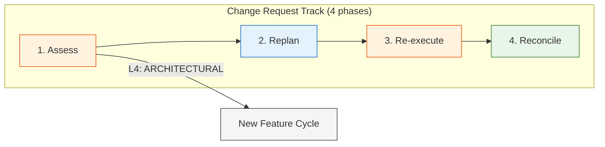
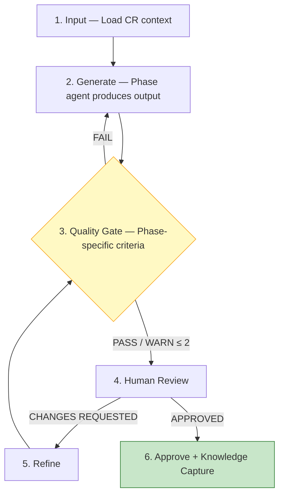
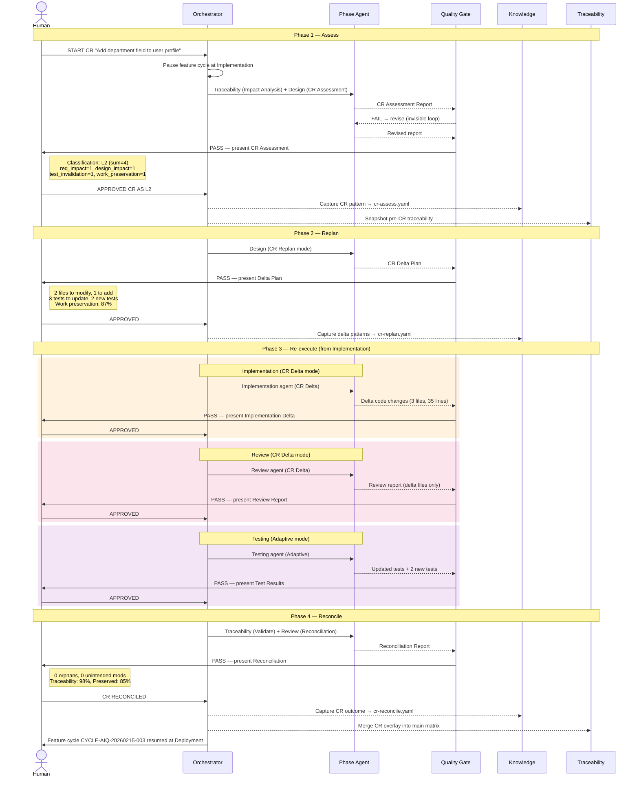

# V-Bounce Change Request Workflow

> Workflow for mid-cycle scope changes (Change Requests) arriving during an active feature cycle.
>
> **Version:** 1.0.0 | **Framework:** V-Bounce v2.0.0
> **See also:** [Feature Workflow](workflows-by-role.md) | [Bugfix Workflow](workflows-bugfix-track.md) | [Hotfix Workflow](workflows-hotfix-track.md)

---

## 1. Overview

The feature workflow (7 phases) assumes stable requirements once approved. In practice, scope changes arrive mid-cycle — from stakeholders, market shifts, or newly discovered constraints. The Change Request (CR) track provides a structured procedure for classifying, assessing, and executing these mid-cycle changes while preserving completed work and maintaining traceability.

### Track Comparison

| Dimension | Feature | Bugfix | Hotfix | **Change Request** |
|-----------|---------|--------|--------|-------------------|
| **Trigger** | Business need / PRD | QA finding / regression | Production incident (P0/P1) | **Scope change during active feature cycle** |
| **Input** | PRD in `docs/features/` | Bug ticket / test failure | Incident report / alerts | **CR description + active cycle state** |
| **Time pressure** | Planned sprint | Normal priority | < 4h (P0) / < 8h (P1) | **Depends on classification (L1-L4)** |
| **Phases** | 7 (Requirements → Deploy) | 6 (Triage → Deploy) | 5 (Triage → Deploy) | **4 (Assess → Reconcile)** |
| **Applies to** | New work | Existing defects | Production defects | **Active feature cycles only** |
| **Design needed** | Full architecture | Impact analysis only | None (post-review) | **Delta design (changed parts only)** |
| **Test scope** | Full 40/30/20/10 suite | Module regression + edge cases | Smoke + fix verification | **Adaptive (update affected tests only)** |
| **Prod approval** | 2/3 quorum | 2/3 quorum | 1/1 + mandatory 24h post-review | **Varies by classification (L1-L4)** |

### Track Selection

The CR track applies when **all** of these conditions are true:

1. A scope change arrives from an external source (stakeholder, customer, market)
2. The change affects an **active feature cycle** (phases 3-7: Implementation through Knowledge)
3. Requirements for the feature have already been **approved** (phase 1 complete)
4. The change is **not** a bug (use bugfix/hotfix tracks) or a new feature (start a new feature cycle)

If the change arrives **before** requirements approval (phases 1-2), simply revise the requirements in the current cycle — no CR track needed.

### CR Flow



---

## 2. CR Classification System (L1-L4)

Every CR is scored across 4 dimensions, each rated 0-3:

### Scoring Dimensions

| Dimension | 0 — None | 1 — Low | 2 — Medium | 3 — High |
|-----------|----------|---------|------------|----------|
| **requirement_impact** | No REQ change | Wording clarification only | New/modified REQ (≤ 2) | New/modified REQ (> 2) or REQ removed |
| **design_impact** | No design change | Config/constant change | Component interface change | Architecture pattern change |
| **test_invalidation** | No tests affected | ≤ 3 tests need update | 4-10 tests need update or new tests | > 10 tests invalidated or new test category |
| **work_preservation** | 100% work preserved | > 90% work preserved | 70-90% work preserved | < 70% work preserved |

### Classification Levels

| Level | Name | Sum Score | Any Dim = 3? | Re-entry Point | Governance |
|-------|------|-----------|--------------|----------------|------------|
| **L1** | COSMETIC | ≤ 1 | No | Resume at current phase | SD or TL (1/2) |
| **L2** | MINOR | 2-4, no dim > 1 | No | Re-enter at Implementation | TL (1/1) |
| **L3** | SIGNIFICANT | 5-8, no dim = 3 | No | Re-enter at Design | TL + Architect (2/2) |
| **L4** | ARCHITECTURAL | ≥ 9 or any dim = 3 | Yes (overrides sum) | New feature cycle | PO + TL + Architect (2/3) |

### Scope Guards per Level

| Guard | L1 | L2 | L3 | L4 |
|-------|-----|-----|-----|-----|
| Max files changed by CR | 3 | 10 | 25 | Unlimited (new cycle) |
| Max REQs added/modified | 0 | 2 | 5 | Unlimited |
| Min work preserved % | 95% | 80% | 60% | N/A |
| Max new tests needed | 3 | 10 | 25 | Unlimited |

If a scope guard is violated during Re-execute, the CR is **reclassified upward** (e.g., L2 → L3).

---

## 3. Phase Anatomy

Every phase follows the standard **6-activity cycle** from the feature workflow:



- **FAIL** → agent revises (human never sees it)
- **WARN > 2** → agent revises and rechecks
- **WARN ≤ 2** → human review with warnings noted
- **PASS** → human review

---

## 4. CR Track (4 Phases)

### 4.1 Assess Phase

Bounce time: **DEEP DIVE** (thorough impact analysis before committing to changes)

| Step | Activity | Who | Does What | Output |
|------|----------|-----|-----------|--------|
| 1 | Input | Orchestrator | Loads CR description, active feature cycle state, traceability snapshot, all approved phase artifacts | Context ready |
| 2 | Generate | Agent: Traceability (Impact Analysis) + Design (CR Assessment) | Traces affected artifacts, scores 4 dimensions, classifies CR, identifies conflicts with in-progress work, produces recommendation | CR Assessment Report |
| 3 | QG | Agent: Quality Gate | Checks: all affected artifacts identified, classification justified with scores, no ambiguous CR requirements, scope creep detection (CR requests more than described), conflict analysis complete | PASS / WARN / FAIL |
| 4 | Review | Person: per classification governance | Reviews impact analysis, validates classification, confirms or overrides level | Feedback |
| 5 | Refine | Agent: Traceability + Design | Adjusts analysis per feedback → back to step 3 | Revised report |
| 6 | Approve | Person: per classification governance | Types `APPROVED CR AS [L1-L4]` or `CR REJECTED` or `CR DEFERRED` or `CR SPLIT` | Phase complete |
| 6a | KC | Agent: Knowledge | Captures CR pattern, classification accuracy, scope creep indicators | `cr-assess.yaml` |

**CR Assessment Report format:**

```yaml
cr_assessment:
  cr_id: "CR-[PROJECT]-[YYYYMMDD]-[###]"
  title: "[CR title]"
  source: "[Who requested the change and why]"
  feature_cycle:
    cycle_id: "CYCLE-[PROJECT]-[YYYYMMDD]-[###]"
    phase_at_arrival: implementation | review | testing | deployment | knowledge
    approved_phases: [requirements, design]  # Phases completed before CR

  classification:
    scores:
      requirement_impact: 0-3
      design_impact: 0-3
      test_invalidation: 0-3
      work_preservation: 0-3
    sum: 0-12
    level: L1 | L2 | L3 | L4
    justification: "[Why this level]"

  impact_analysis:
    affected_requirements:
      - req_id: "REQ-###"
        change_type: UNCHANGED | MODIFIED | NEW | REMOVED
        description: "[What changes]"
    affected_components:
      - component: "[Component name]"
        impact: "[Description of change needed]"
    affected_files:
      - file: "path/to/file"
        impact: modify | add | delete
        lines_estimated: 0
    affected_tests:
      - test: "path/to/test"
        status: valid | needs_update | invalidated | new_needed

  conflict_analysis:
    in_progress_conflicts:
      - artifact: "[What's in progress]"
        conflict: "[How CR conflicts]"
        resolution: "[Suggested resolution]"
    dependency_conflicts: []

  recommendation: APPROVE | REJECT | DEFER | SPLIT
  recommendation_rationale: "[Why]"
  estimated_effort:
    phases_to_replay: [implementation, review, testing]
    files_affected: 5
    tests_affected: 8
    work_preservation_pct: 85
```

**Approval governance by classification:**

| Level | Approvers | Quorum |
|-------|-----------|--------|
| L1 | SD or TL | 1 of 2 |
| L2 | TL | 1 of 1 |
| L3 | TL + Architect | 2 of 2 |
| L4 | PO + TL + Architect | 2 of 3 |

**Decision commands:**
- `APPROVED CR AS L1` / `L2` / `L3` / `L4` — proceed to Replan (or new cycle for L4)
- `CR REJECTED` — CR is denied, feature cycle resumes unchanged
- `CR DEFERRED` — CR is queued for a future cycle, feature cycle resumes
- `CR SPLIT` — CR is split into smaller CRs; each assessed independently
- `OVERRIDE CLASSIFICATION [L1-L4]` — human overrides the agent's classification (must provide justification)

### 4.2 Replan Phase

Bounce time: **STANDARD** (delta planning, not full architecture)

Applies to L1-L3 only. L4 exits to a new feature cycle.

| Step | Activity | Who | Does What | Output |
|------|----------|-----|-----------|--------|
| 1 | Input | Orchestrator | Loads approved CR assessment, pre-CR traceability snapshot, all approved phase artifacts | Context ready |
| 2 | Generate | Agent: Design (CR Replan mode) | Produces requirement delta, design delta, code delta plan, test impact plan, work preservation map | CR Delta Plan |
| 3 | QG | Agent: Quality Gate | Checks: delta proportional to classification, scope guards enforced, no orphaned requirements (every modified REQ has a test plan), work preservation map consistent with classification | PASS / WARN / FAIL |
| 4 | Review | Person: per classification governance | Reviews delta plan, confirms scope is minimal, validates work preservation | Feedback |
| 5 | Refine | Agent: Design | Adjusts delta plan per feedback → back to step 3 | Revised plan |
| 6 | Approve | Person: per classification governance | Types `APPROVED` | Phase complete |
| 6a | KC | Agent: Knowledge | Captures delta planning patterns, scope guard adherence | `cr-replan.yaml` |

**CR Delta Plan format:**

```yaml
cr_delta_plan:
  cr_id: "CR-[PROJECT]-[YYYYMMDD]-[###]"
  classification: L1 | L2 | L3
  re_entry_point: current_phase | implementation | design

  requirement_delta:
    - req_id: "REQ-###"
      status: UNCHANGED | MODIFIED | NEW | REMOVED
      before: "[Original text or null]"
      after: "[New text or null]"
      rationale: "[Why this change]"

  design_delta:
    components_modified:
      - component: "[Name]"
        change: "[What changes in the design]"
    components_added: []
    components_removed: []
    api_changes:
      - endpoint: "[Method /path]"
        change_type: modified | added | removed
        description: "[What changes]"

  code_delta:
    files_to_modify:
      - file: "path/to/file"
        changes: "[Description of code changes needed]"
    files_to_add: []
    files_to_remove: []

  test_impact:
    tests_unchanged: 45    # Tests that remain valid
    tests_to_update:
      - test: "path/to/test"
        reason: "[Why update needed]"
    tests_to_add:
      - description: "[New test needed]"
        for_req: "REQ-###"
    tests_to_remove:
      - test: "path/to/test"
        reason: "[Why no longer relevant]"

  work_preservation:
    total_artifacts: 60
    unchanged: 52
    modified: 6
    new: 2
    removed: 0
    preservation_pct: 86.7
    preserved_phases:
      requirements: partially_preserved  # Some REQs modified
      design: partially_preserved         # Some components modified
      implementation: to_be_replayed      # Must re-enter here
      testing: to_be_replayed
```

**Scope guard enforcement:**

If the delta plan exceeds scope guards for the classification level, QG issues WARN and recommends reclassification:

```
QG WARN: CR classified as L2 but delta exceeds L2 scope guards.
  - Files affected: 12 (limit: 10)
  - Recommend: OVERRIDE CLASSIFICATION L3 or reduce scope via CR SPLIT
```

### 4.3 Re-execute Phase

Bounce time: **Varies by re-entry point** (FAST TRACK for L1, STANDARD for L2-L3)

Replays pipeline phases from the re-entry point in **CR Delta mode** — agents only process changes, not full regeneration.

| Level | Re-entry Point | Phases Replayed |
|-------|----------------|-----------------|
| L1 | Current phase | Apply cosmetic change at current phase only |
| L2 | Implementation | Implementation (delta) → Review (delta) → Testing (adaptive) → onward |
| L3 | Design | Design (delta) → Implementation (delta) → Review (delta) → Testing (adaptive) → onward |

Each replayed phase follows the standard 6-activity loop, with these CR-specific modifications:

**CR Delta mode rules:**
- Agents receive both the **original approved artifacts** and the **CR delta plan**
- Agents only modify artifacts listed in the delta plan
- Unchanged artifacts are carried forward without regeneration
- QG validates that only delta-specified artifacts were modified
- Traceability updates track both original and CR-modified mappings

#### L1 Re-execute (Cosmetic)

| Step | Activity | Who | Does What | Output |
|------|----------|-----|-----------|--------|
| 1 | Input | Orchestrator | Loads current phase context + CR delta (cosmetic) | Context ready |
| 2 | Generate | Agent: Current phase agent | Applies cosmetic change (label rename, constant adjustment, config tweak) | Updated artifact |
| 3 | QG | Agent: Quality Gate | Checks: change is truly cosmetic (≤ 3 files, 0 behavioral change), no side effects | PASS / WARN / FAIL |
| 4 | Review | Person: SD or TL | Confirms cosmetic-only change | Feedback |
| 5 | Refine | Agent: Current phase agent | Adjusts if needed → back to step 3 | Revised artifact |
| 6 | Approve | Person: SD or TL (1/2) | Types `APPROVED` | Re-execute complete |

#### L2 Re-execute (Minor — from Implementation)

Replays: Implementation (delta) → Review (delta) → Testing (adaptive) → Deployment → Knowledge

| Phase | Agent Mode | Processes | Scope Guard |
|-------|-----------|-----------|-------------|
| Implementation | Implementation (CR Delta) | Only files in `code_delta` | ≤ 10 files, ≤ 2 new REQs |
| Review | Review (CR Delta) | Only modified/new files | Reviews delta + adjacent code |
| Testing | Testing (Adaptive) | Updates affected tests, adds new tests for new REQs | ≤ 10 new tests |
| Deployment | Standard | Full deployment pipeline (not delta) | Normal deployment process |
| Knowledge | Per-phase capture | Captures CR-specific learnings | Normal KC |

Each phase uses the standard 6-activity loop. Human approval required at each phase per normal governance.

#### L3 Re-execute (Significant — from Design)

Replays: Design (delta) → Implementation (delta) → Review (delta) → Testing (adaptive) → Deployment → Knowledge

| Phase | Agent Mode | Processes | Scope Guard |
|-------|-----------|-----------|-------------|
| Design | Design (CR Delta) | Only components/APIs in `design_delta` | ≤ 25 files affected, ≤ 5 REQs |
| Implementation | Implementation (CR Delta) | Only files in `code_delta` | ≤ 25 files |
| Review | Review (CR Delta) | Modified/new files + design conformance check | Reviews delta + architecture |
| Testing | Testing (Adaptive) | Updates affected tests, adds tests for new REQs | ≤ 25 new tests |
| Deployment | Standard | Full deployment pipeline | Normal deployment process |
| Knowledge | Per-phase capture | Captures CR-specific learnings | Normal KC |

**Reclassification during Re-execute:**

If scope guards are violated during any replayed phase:

1. QG issues FAIL with scope violation details
2. Agent cannot proceed
3. Human must either:
   - `OVERRIDE CLASSIFICATION [higher level]` — restart Re-execute from the new re-entry point
   - `ABORT CR` — abandon the CR, revert to pre-CR state
   - Reduce scope and retry

### 4.4 Reconcile Phase

Bounce time: **STANDARD** (verification that original + delta = coherent whole)

| Step | Activity | Who | Does What | Output |
|------|----------|-----|-----------|--------|
| 1 | Input | Orchestrator | Loads pre-CR artifacts, CR delta artifacts, updated traceability | Context ready |
| 2 | Generate | Agent: Traceability (Validate) + Review (Reconciliation mode) | Verifies: (1) original + delta = coherent whole, (2) no orphaned artifacts, (3) no accidental modifications to unchanged artifacts, (4) traceability matrix is complete and consistent | Reconciliation Report |
| 3 | QG | Agent: Quality Gate | Checks: 0 orphaned requirements, 0 orphaned tests, 0 unintended modifications, traceability completeness ≥ 95%, work preservation within classification bounds | PASS / WARN / FAIL |
| 4 | Review | Person: per classification governance | Reviews reconciliation report, confirms coherent whole | Feedback |
| 5 | Refine | Agent: Traceability + Review | Fixes gaps, updates mappings → back to step 3 | Revised report |
| 6 | Approve | Person: per classification governance | Types `CR RECONCILED` | CR complete, feature cycle resumes |
| 6a | KC | Agent: Knowledge | Captures CR outcome metrics: predicted vs actual impact, work preserved, lessons | `cr-reconcile.yaml` |

**Reconciliation Report format:**

```yaml
reconciliation_report:
  cr_id: "CR-[PROJECT]-[YYYYMMDD]-[###]"
  classification: L1 | L2 | L3

  coherence_check:
    status: PASS | FAIL
    issues: []  # Any inconsistencies found

  orphan_check:
    orphaned_requirements: []   # REQs without tests
    orphaned_tests: []          # Tests without REQs
    orphaned_components: []     # Components without REQs

  modification_audit:
    intended_modifications: 6
    actual_modifications: 6
    unintended_modifications: 0  # Must be 0
    unintended_files: []

  traceability:
    completeness_pct: 98.5
    new_mappings_added: 4
    mappings_updated: 6
    mappings_removed: 0

  work_preservation:
    predicted_pct: 86.7   # From Replan phase
    actual_pct: 85.0      # After Re-execute
    variance: -1.7        # Acceptable if within 5%

  verdict: RECONCILED | NEEDS_REPAIR
```

**Post-reconciliation:**
- `CR RECONCILED` → CR overlay is merged into main traceability matrix
- Feature cycle resumes at the phase where it was interrupted (or the next phase if the interrupted phase was replayed)
- CR state is archived in the cycle history

---

## 5. Roles & Responsibilities

### Person Roles

| Phase | Product Owner | Tech Lead | Architect | Senior Developer |
|-------|--------------|-----------|-----------|-----------------|
| **Assess (L1)** | — | Approves (1/2) | — | Approves (1/2) |
| **Assess (L2)** | — | Approves (1/1) | — | — |
| **Assess (L3)** | — | Approves (2/2) | Approves (2/2) | — |
| **Assess (L4)** | Approves (2/3) | Approves (2/3) | Approves (2/3) | — |
| **Replan** | — | Per classification | Per classification (L3) | Per classification (L1) |
| **Re-execute** | — | Per replayed phase standard governance | Per replayed phase | Per replayed phase |
| **Reconcile** | — | Per classification | Per classification (L3) | Per classification (L1) |

### Agent Roles

| Phase | Phase Agent | Quality Gate Checks | Knowledge Captures |
|-------|-----------|-------------|-----------|
| **Assess** | Traceability (Impact Analysis) + Design (CR Assessment) | Artifacts identified, classification justified, no ambiguous CR, scope creep detected | CR pattern, classification accuracy |
| **Replan** | Design (CR Replan mode) | Delta proportional to classification, scope guards, no orphans | Delta planning patterns |
| **Re-execute** | Varies by replayed phase (all in CR Delta mode) | Per replayed phase criteria + delta-only enforcement | Per-phase CR-specific learnings |
| **Reconcile** | Traceability (Validate) + Review (Reconciliation mode) | 0 orphans, 0 unintended modifications, traceability complete | CR outcome metrics |

---

## 6. Quality Gate Criteria

| Phase | PASS | WARN | FAIL |
|-------|------|------|------|
| **Assess** | All artifacts traced, classification justified, no ambiguous CR requirements, conflicts identified | Classification borderline (sum ± 1 from threshold), minor ambiguity in CR description | Missing artifact trace, unjustified classification, ambiguous CR requirements, scope creep detected |
| **Replan** | Delta proportional to classification, scope guards met, no orphaned REQs, work preservation consistent | Scope guard within 10% of limit, work preservation 5% below target | Delta exceeds classification scope, orphaned REQs, work preservation violation > 10% |
| **Re-execute** | Per replayed phase QG criteria + only delta-specified artifacts modified | Minor scope creep (1 extra file beyond delta plan) | Scope guard violated, non-delta artifacts modified, replayed phase QG FAIL |
| **Reconcile** | 0 orphans, 0 unintended modifications, traceability ≥ 95%, work preservation within 5% of predicted | Traceability 90-95%, work preservation 5-10% below predicted | Orphaned artifacts, unintended modifications, traceability < 90%, work preservation > 10% below |

---

## 7. State Management

```yaml
vbounce_cr_state:
  track: change_request
  cr_id: "CR-[PROJECT]-[YYYYMMDD]-[###]"
  title: "[CR title]"
  source: "[Who requested]"

  feature_cycle:
    cycle_id: "CYCLE-[PROJECT]-[YYYYMMDD]-[###]"
    phase_at_arrival: implementation | review | testing | deployment | knowledge
    paused_at_step: generation | quality_gate | review | refinement | approval

  classification:
    level: L1 | L2 | L3 | L4
    scores:
      requirement_impact: 0-3
      design_impact: 0-3
      test_invalidation: 0-3
      work_preservation: 0-3
    sum: 0-12
    override: null | { from: L2, to: L3, reason: "[Justification]" }

  current_phase: assess | replan | re_execute | reconcile
  phase_anatomy_step: input | generation | quality_gate | review | refinement | approval | post_phase

  phases:
    assess:
      status: approved | pending | not_started
      decision: APPROVED_CR | CR_REJECTED | CR_DEFERRED | CR_SPLIT
      approved_by: ["TL"]
    replan:
      status: approved | pending | not_started | skipped  # skipped for L4
      scope_guard_violations: 0
      approved_by: ["TL"]
    re_execute:
      status: completed | in_progress | not_started | skipped
      re_entry_point: current_phase | implementation | design
      phases_replayed:
        design: { status: approved | skipped, mode: cr_delta }
        implementation: { status: approved | pending | skipped, mode: cr_delta }
        review: { status: approved | pending | skipped, mode: cr_delta }
        testing: { status: approved | pending | skipped, mode: adaptive }
        deployment: { status: approved | pending | skipped, mode: standard }
      approved_by: ["SD", "TL"]
    reconcile:
      status: reconciled | pending | not_started
      orphan_count: 0
      unintended_modifications: 0
      traceability_completeness_pct: 98.5
      approved_by: ["TL"]

  metrics:
    predicted_impact:
      files_affected: 5
      tests_affected: 8
      work_preservation_pct: 86.7
    actual_impact:
      files_affected: 5
      tests_affected: 9
      work_preservation_pct: 85.0
    classification_accuracy: true  # Did predicted level match actual effort?

  knowledge:
    assess_captured: true
    replan_captured: true
    reconcile_captured: true
```

---

## 8. Commands

All standard V-Bounce commands apply within replayed phases. CR-specific commands:

| Command | When to Use | Effect |
|---------|------------|--------|
| `START CR [description]` | Scope change arrives during active feature cycle | Pauses feature cycle, creates CR cycle, enters Assess phase |
| `APPROVED CR AS [L1-L4]` | Assess phase | Accepts classification and proceeds to Replan (L1-L3) or exits to new cycle (L4) |
| `CR REJECTED` | Assess phase | CR is denied, feature cycle resumes unchanged |
| `CR DEFERRED` | Assess phase | CR is queued for future cycle, feature cycle resumes |
| `CR SPLIT` | Assess phase | CR is split into smaller CRs, each assessed independently |
| `OVERRIDE CLASSIFICATION [L1-L4]` | Assess or Re-execute phase | Human overrides classification (must provide justification) |
| `CR RECONCILED` | Reconcile phase | CR is complete, overlay merged into main traceability, feature resumes |
| `ABORT CR` | Any CR phase | Abandons CR, reverts to pre-CR state, feature cycle resumes |

**Standard commands within replayed phases:**
- `APPROVED` / `APPROVED AS [Role]` — standard phase approval during Re-execute
- `CHANGES REQUESTED` — refinement loop during any CR phase
- `ROLLBACK TO [phase]` — within Re-execute, return to earlier replayed phase

---

## 9. Multiple CR Handling

### Sequential Processing (FIFO)

CRs are processed one at a time in arrival order:

1. **CR1 arrives** → feature cycle paused, CR1 processed through all 4 phases
2. **CR2 arrives during CR1** → CR2 is queued, CR1 continues
3. **CR1 reconciled** → CR2 assessment begins (against the now-CR1-modified baseline)

### Conflict Detection

If CR2 conflicts with CR1 (both modify the same REQ, component, or file):

```yaml
cr_conflict:
  cr1_id: "CR-AIQ-20260301-001"
  cr2_id: "CR-AIQ-20260301-002"
  conflicts:
    - type: requirement_overlap
      artifact: "REQ-005"
      cr1_change: "Add email validation"
      cr2_change: "Remove email field entirely"
      resolution_needed: true
```

**Conflict resolution:**
- Orchestrator flags the conflict when CR2 enters Assess phase
- Human decides: prioritize CR1 or CR2, merge changes, or reject one
- The decision is documented in the CR2 assessment report

### Escalation Rule

If the combined impact of multiple CRs (CR1 + CR2 + ... CRn) exceeds L3 scope guards:

```
WARN: Combined CR impact exceeds L3 scope guards.
  Total files affected: 30 (L3 limit: 25)
  Total REQs changed: 7 (L3 limit: 5)
  Recommend: Escalate to L4 (new feature cycle) to properly re-architect.
```

Human must decide: continue processing individually or escalate to a new cycle.

---

## 10. Anti-Patterns

| # | DON'T | DO | Why |
|---|-------|-----|-----|
| 1 | Skip Assess and jump straight to coding the change | Always run full impact analysis first | Unassessed changes corrupt traceability and introduce hidden scope creep |
| 2 | Underclassify to avoid governance overhead | Score honestly across all 4 dimensions | Underclassified CRs blow up during Re-execute when scope guards are violated |
| 3 | Regenerate everything from scratch | Use CR Delta mode — only process what changed | Full regeneration wastes work, introduces unnecessary risk, and defeats the purpose of work preservation |
| 4 | Modify artifacts not in the delta plan | Agents must only touch delta-specified artifacts | Unplanned modifications corrupt unchanged work and break traceability |
| 5 | Use CR track for bugs discovered during implementation | File a separate bugfix ticket | Bugs and scope changes have different root causes and different workflows |
| 6 | Queue multiple CRs and process them all at once | Process sequentially (FIFO) — each CR assessed against the latest baseline | Batch processing creates compounding conflicts and makes rollback impossible |
| 7 | Skip Reconcile because "it all looks fine" | Always run Reconcile — it catches subtle integration issues | Original + delta can have emergent inconsistencies not visible in isolation |
| 8 | Use CR track for changes before requirements approval | Revise requirements directly in the current cycle | Pre-approval changes are normal iteration, not change requests |

---

## 11. Integration with Other Tracks

### CRs Apply to Feature Cycles Only

Change Requests are scoped to **active feature cycles** (phases 3-7). They do **not** apply to:

- **Bugfix cycles** — if scope changes during a bugfix, restart triage with the new context. See [Bugfix Integration](workflows-bugfix-track.md#9-integration-with-feature-workflow).
- **Hotfix cycles** — if scope changes during a hotfix, the hotfix is wrong. Re-triage. See [Hotfix Integration](workflows-hotfix-track.md#10-integration).

### Feature Paused by Bugfix/Hotfix

If a feature cycle is paused for a bugfix or hotfix, and a CR arrives during the pause:

1. CR is **queued** (not processed) until the feature cycle resumes
2. When the feature resumes, queued CRs enter Assess phase in FIFO order
3. The bugfix/hotfix outcome may invalidate or change the CR — re-evaluate during Assess

### CR Reveals a Bug

During CR Re-execute, if the agent discovers a pre-existing bug:

1. **Do not fix the bug in the CR** — it's out of scope
2. File a separate bugfix ticket
3. Document the bug in the CR knowledge capture
4. If the bug blocks the CR, pause the CR, complete the bugfix, then resume

### CR and Traceability

CR traceability is an **overlay** on the feature's traceability matrix:

```yaml
cr_traceability_overlay:
  cr_id: "CR-AIQ-20260301-001"
  base_matrix: "TM-AIQ-20260215"  # Pre-CR matrix version

  modifications:
    - req_id: "REQ-005"
      change: MODIFIED
      before: "User can update profile name"
      after: "User can update profile name and department"
      affected_chain:
        story: "US-005"
        acs: ["AC-005-1", "AC-005-3"]  # Modified
        components: ["ProfileService"]   # Modified
        files: ["update_profile.py"]     # Modified
        tests: ["test_profile_update"]   # Needs update

  additions:
    - req_id: "REQ-012"
      type: NEW
      chain:
        story: "US-012"
        acs: ["AC-012-1"]
        components: ["DepartmentService"]
        files: ["department_lookup.py"]
        tests: ["test_department_lookup"]

  merged_into: "TM-AIQ-20260301"  # Post-CR matrix version (after RECONCILED)
```

---

## 12. Practical Walkthrough

### Full CR Walkthrough: L2 — "Add department field to user profile"

**Context:** Feature cycle CYCLE-AIQ-20260215-003 is in Implementation phase (phase 3). Stakeholder requests adding a "department" dropdown to the user profile, sourced from an existing department table.



#### Phase 1: Assess

**Human provides** CR context:

```
HUMAN:  START CR
        Title: Add department field to user profile
        Source: VP Engineering — needs department for reporting dashboards
        Description: Add a "department" dropdown to the user profile form.
        Department list sourced from existing departments table.
        Display on profile view and include in profile API response.
```

> **Invisible:** Orchestrator pauses feature cycle at Implementation, creates CR-AIQ-20260301-001. Traceability agent traces impact, Design agent classifies.

**Agent presents** CR Assessment Report (after QG PASS):

```yaml
cr_assessment:
  cr_id: "CR-AIQ-20260301-001"
  title: "Add department field to user profile"
  source: "VP Engineering — reporting dashboards"
  feature_cycle:
    cycle_id: "CYCLE-AIQ-20260215-003"
    phase_at_arrival: implementation
    approved_phases: [requirements, design]

  classification:
    scores:
      requirement_impact: 1   # 1 REQ modified (add field), 0 removed
      design_impact: 1        # ProfileService modified, DepartmentService reused
      test_invalidation: 1    # 3 profile tests need department field added
      work_preservation: 1    # >90% of implementation work preserved
    sum: 4
    level: L2
    justification: "Minor addition to existing entity. No new architecture
                    patterns. Existing department table reused. Small test delta."

  impact_analysis:
    affected_requirements:
      - req_id: "REQ-005"
        change_type: MODIFIED
        description: "Add department_id to profile update/view"
    affected_components:
      - component: "ProfileService"
        impact: "Add department_id field to update command and query response"
      - component: "DepartmentService"
        impact: "Already exists — no changes needed, just referenced"
    affected_files:
      - file: "api/application/commands/update_profile.py"
        impact: modify
        lines_estimated: 8
      - file: "api/application/queries/get_profile.py"
        impact: modify
        lines_estimated: 5
      - file: "api/application/dtos/profile_dto.py"
        impact: modify
        lines_estimated: 10
    affected_tests:
      - test: "test_update_profile.py"
        status: needs_update
      - test: "test_get_profile.py"
        status: needs_update
      - test: "test_profile_dto.py"
        status: needs_update

  conflict_analysis:
    in_progress_conflicts: []  # No conflicts with current implementation work
    dependency_conflicts: []

  recommendation: APPROVE
  recommendation_rationale: "Low-impact addition. Reuses existing infrastructure.
                             No architecture changes needed."
  estimated_effort:
    phases_to_replay: [implementation, review, testing]
    files_affected: 3
    tests_affected: 5
    work_preservation_pct: 87
```

**Human approves:**

```
HUMAN:  APPROVED CR AS L2
        (Classification matches my assessment. Department table already exists.)
```

#### Phase 2: Replan

> **Invisible:** Design agent (CR Replan mode) produces delta plan. QG checks proportionality.

**Agent presents** Delta Plan (after QG PASS):

```yaml
cr_delta_plan:
  cr_id: "CR-AIQ-20260301-001"
  classification: L2
  re_entry_point: implementation

  requirement_delta:
    - req_id: "REQ-005"
      status: MODIFIED
      before: "User can update profile name and avatar"
      after: "User can update profile name, avatar, and department"
      rationale: "VP Engineering needs department for reporting"

  code_delta:
    files_to_modify:
      - file: "api/application/commands/update_profile.py"
        changes: "Add department_id to command input + validate against departments table"
      - file: "api/application/queries/get_profile.py"
        changes: "Include department name in profile query response"
      - file: "api/application/dtos/profile_dto.py"
        changes: "Add department_id (input) and department_name (output) fields"
    files_to_add: []
    files_to_remove: []

  test_impact:
    tests_unchanged: 42
    tests_to_update:
      - test: "test_update_profile.py::test_profile_update_success"
        reason: "Add department_id to test input"
      - test: "test_get_profile.py::test_profile_response_fields"
        reason: "Assert department_name in response"
      - test: "test_profile_dto.py::test_dto_serialization"
        reason: "Add department fields to DTO tests"
    tests_to_add:
      - description: "test_update_profile_invalid_department"
        for_req: "REQ-005"
      - description: "test_update_profile_null_department"
        for_req: "REQ-005"
    tests_to_remove: []

  work_preservation:
    total_artifacts: 60
    unchanged: 52
    modified: 6
    new: 2
    removed: 0
    preservation_pct: 86.7
```

**Human approves:**

```
HUMAN:  APPROVED
        (Delta is minimal and well-scoped. 3 files, 5 test changes.)
```

#### Phases 3-4: Re-execute → Reconcile

> Same interaction pattern: invisible QG → agent presents → human approves. Compressed to show key outputs.

**Re-execute — Implementation (CR Delta):**

```
Delta changes applied:
  update_profile.py: +8 lines (department_id in command)
  get_profile.py: +5 lines (department join in query)
  profile_dto.py: +10 lines (department fields in DTO)
Scope: 3 files, 23 lines (within L2 limit: 10 files)
```

**Re-execute — Review (CR Delta):**

```
Review (delta files only):
  Hallucination: 100 — no new packages
  Security: 95 — department_id validated against FK
  Fix correctness: 90 — department join is correct
  Overall: 95 → APPROVE
```

**Re-execute — Testing (Adaptive):**

```
Updated: 3 existing tests (added department assertions)
New: 2 tests (invalid department, null department)
All tests: 47/47 PASS
```

**Reconcile:**

```
Reconciliation:
  Orphaned requirements: 0
  Orphaned tests: 0
  Unintended modifications: 0
  Traceability completeness: 98.5%
  Work preservation: predicted 86.7%, actual 85.0% (variance -1.7%)
  Verdict: RECONCILED
```

**Human finalizes:**

```
HUMAN:  CR RECONCILED
        (Clean integration. Feature cycle resumes at Deployment.)
```

> **Invisible:** KC archives CR metrics. Traceability overlay merged into main matrix. Feature cycle CYCLE-AIQ-20260215-003 resumes at Deployment phase.

**CR summary:** 7 human touchpoints (Assess + Replan + 3 Re-execute phases + Reconcile + final command). L2 CR completed with 85% work preservation.
