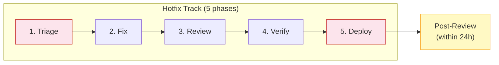
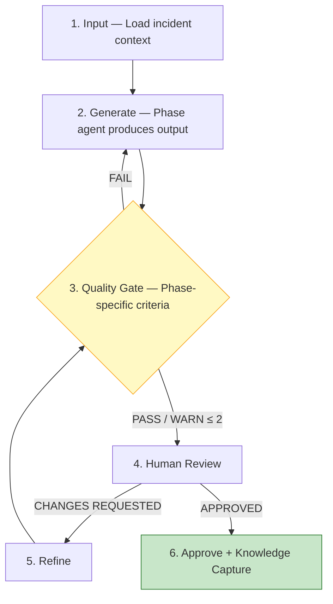
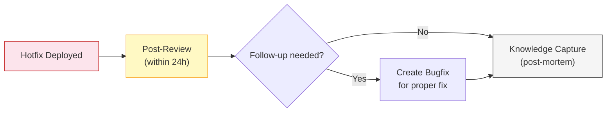
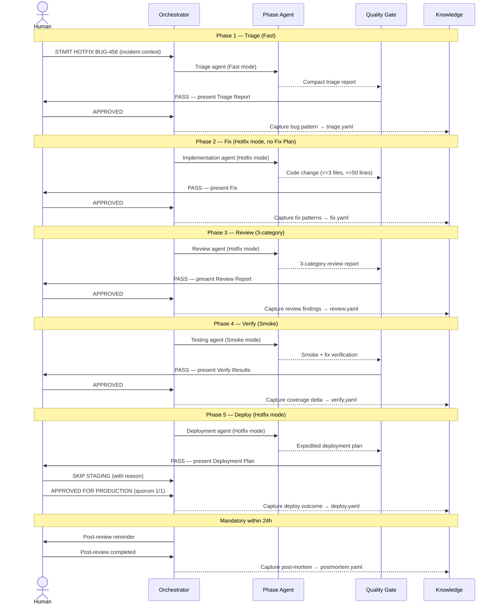
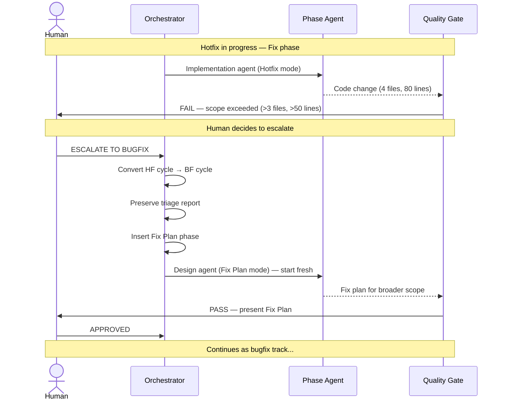

# V-Bounce Hotfix Workflow

> Workflow for urgent production incidents (P0/P1) within the V-Bounce SDLC framework.
>
> **Version:** 1.0.0 | **Framework:** V-Bounce v2.0.0
> **See also:** [Bugfix Workflow](workflows-bugfix-track.md) for P2/P3 non-urgent bugs.

---

## 1. Overview

Hotfixes are for production incidents requiring immediate resolution. Reduced rigor compensated by mandatory 24h post-review.

| Dimension | Hotfix | Bugfix |
|-----------|--------|--------|
| **Trigger** | Production incident (P0/P1) | QA finding / regression |
| **Time pressure** | **< 4h** (P0) / **< 8h** (P1) | Normal priority (next sprint) |
| **Phases** | **5** (no Fix Plan) | 6 (includes Fix Plan) |
| **Scope limits** | **3 files, 50 lines** (hard) | 5 files, 100 lines (soft) |
| **Review scope** | **3-category** | 5-category |
| **Test scope** | **Smoke + fix verification** | Module regression + edge cases |
| **Deploy path** | Expedited (staging optional) | Standard pipeline |
| **Prod approval** | **1/1** + mandatory 24h post-review | 2/3 quorum |
| **Who reviews** | TL or On-Call only | SD, TL, QA |

### Track Selection

| Priority | SLA | Track |
|----------|-----|-------|
| **P0** — System down | 4h to mitigate | **Hotfix** (this doc) |
| **P1** — Major degradation | 8h to mitigate | **Hotfix** (this doc) |
| **P2** — Minor issue | Next sprint | [Bugfix](workflows-bugfix-track.md) |
| **P3** — Cosmetic / low impact | Backlog | [Bugfix](workflows-bugfix-track.md) |

### Hotfix Flow



---

## 2. Phase Anatomy

Every phase follows a **6-activity cycle** (same as bugfix/feature):



- **FAIL** → agent revises (human never sees it)
- **WARN > 2** → agent revises and rechecks
- **WARN ≤ 2** → human review with warnings noted
- **PASS** → human review

---

## 3. Hotfix Track (5 Phases)

### 3.1 Triage Phase

Bounce time: **FAST TRACK** (reproduce and confirm, don't investigate deeply)

| Step | Activity | Who | Does What | Output |
|------|----------|-----|-----------|--------|
| 1 | Input | Orchestrator | Loads incident report, error logs, monitoring alerts | Context ready |
| 2 | Generate | Agent: Triage (Fast mode) | Reproduces bug, confirms root cause, writes minimal failing test, identifies smallest fix | Triage Report (compact) |
| 3 | QG | Agent: Quality Gate | Checks: bug reproduced (≥ LIKELY), root cause identified, affected files listed, failing test present | PASS / WARN / FAIL |
| 4 | Review | Person: TL or On-Call | Confirms root cause, approves fix direction | Feedback |
| 5 | Refine | Agent: Triage | Adjusts if needed → back to step 3 | Revised report |
| 6 | Approve | Person: TL or On-Call | Types `APPROVED` (quorum: 1 of 1) | Phase complete |

**Approval:** 1 of [Tech Lead, On-Call Lead]

**Hotfix triage** skips (deferred to post-review):
- Deep blast radius analysis
- Alternative approach evaluation
- Extensive edge case identification

### 3.2 Fix Phase

Bounce time: **FAST TRACK** (smallest possible change)

No Fix Plan phase — fix direction is embedded in the Triage report.

| Step | Activity | Who | Does What | Output |
|------|----------|-----|-----------|--------|
| 1 | Input | Orchestrator | Loads triage report, affected files | Context ready |
| 2 | Generate | Agent: Implementation (Hotfix mode) | Implements minimal fix, updates regression test to pass, adds 1 fix verification test | Code change + tests |
| 3 | QG | Agent: Quality Gate | Checks: regression test passes, no hallucinated packages, change is ≤ 3 files and ≤ 50 lines, no refactoring | PASS / WARN / FAIL |
| 4 | Review | Person: TL or On-Call | Reviews fix, confirms minimal scope | Feedback |
| 5 | Refine | Agent: Implementation | Adjusts → back to step 3 | Revised code |
| 6 | Approve | Person: TL or On-Call | Types `APPROVED` (quorum: 1 of 1) | Phase complete |

**Approval:** 1 of [Tech Lead, On-Call Lead]

**Hotfix scope hard limits:**
- Maximum **3 files** changed (QG FAIL if exceeded)
- Maximum **50 lines** changed (QG FAIL if exceeded)
- **Zero** new dependencies allowed
- **Zero** refactoring allowed
- If fix exceeds limits → `ESCALATE TO BUGFIX` or temporary workaround + follow-up bugfix

### 3.3 Review Phase

Bounce time: **FAST TRACK** (3-category review, not 5)

| Step | Activity | Who | Does What | Output |
|------|----------|-----|-----------|--------|
| 1 | Input | Orchestrator | Loads fix code, triage report | Context ready |
| 2 | Generate | Agent: Review (Hotfix mode) | Runs 3-category review: regression risk (40%), fix correctness (35%), hallucination (25%) | Review report |
| 3 | QG | Agent: Quality Gate | Validates review completeness | PASS / WARN / FAIL |
| 4 | Review | Person: TL or On-Call | Reviews findings | Feedback |
| 5 | Refine | Agent: Review | Re-evaluates → back to step 3 | Revised report |
| 6 | Approve | Person: TL or On-Call | Accepts verdict (hotfix thresholds below) | Phase complete |

**Approval:** 1 of [Tech Lead, On-Call Lead]

**Hotfix verdict thresholds:**
- `regression_risk_score < 70` → REQUEST_CHANGES (critical — cannot ship)
- `fix_correctness_score < 70` → REQUEST_CHANGES (not addressing root cause)
- `overall_score ≥ 80 AND no critical` → APPROVE
- `overall_score ≥ 60` → COMMENT (minor concerns, acceptable for hotfix urgency)

**Hotfix review drops** (deferred to post-review):
- Scope containment check (already enforced by QG hard limits)
- Test adequacy check

### 3.4 Verify Phase

Bounce time: **FAST TRACK** (smoke tests + fix verification only)

| Step | Activity | Who | Does What | Output |
|------|----------|-----|-----------|--------|
| 1 | Input | Orchestrator | Loads fix code, regression test | Context ready |
| 2 | Generate | Agent: Testing (Smoke mode) | Runs: (1) regression test passes, (2) fix verification test passes, (3) smoke test suite passes | Test results |
| 3 | QG | Agent: Quality Gate | Checks: regression test passes, smoke tests pass, no critical test failures | PASS / WARN / FAIL |
| 4 | Review | Person: TL or On-Call | Confirms test results | Feedback |
| 5 | Refine | Agent: Testing | Fixes test issues → back to step 3 | Revised results |
| 6 | Approve | Person: TL or On-Call | Types `APPROVED` (quorum: 1 of 1) | Phase complete |

**Approval:** 1 of [Tech Lead, On-Call Lead]

**Smoke mode** does NOT run (deferred to post-review):
- Full module regression suite
- Edge case generation
- Distribution validation

### 3.5 Deploy Phase

Bounce time: **FAST TRACK** (expedited deployment)

| Step | Activity | Who | Does What | Output |
|------|----------|-----|-----------|--------|
| 1 | Input | Orchestrator | Loads test results, deployment config | Context ready |
| 2 | Generate | Agent: Deployment (Hotfix mode) | Creates expedited deployment plan with auto-rollback trigger: error rate > 1% OR p95 > 500ms within 15 min | Deployment plan |
| 3 | QG | Agent: Quality Gate | Checks: rollback plan present, monitoring alerts configured, fix summary documented | PASS / WARN / FAIL |
| 4 | Review-Staging | Person: TL or On-Call | **Optional** — TL decides if staging is needed. If skipped, must document reason | `SKIP STAGING` or `APPROVED FOR STAGING` |
| 5 | Review-Prod | Person: TL or On-Call | Approves production deployment (quorum: 1 of 1) | `APPROVED FOR PRODUCTION` |
| 6 | Monitor | Agent: Deployment | Post-deploy monitoring: 1h intensive (check every 5 min), then 24h standard | Monitoring report |

**Staging approval:** Optional (TL decides) — must document reason if skipped
**Production approval:** 1 of [Tech Lead, On-Call Lead]

**Mandatory post-deploy:**
- 24h monitoring with auto-rollback triggers
- Full regression test suite run within 24h
- Post-review meeting within 24h (see section 4)

---

## 4. Mandatory Post-Hotfix Review

Every hotfix triggers a **mandatory post-review within 24 hours**. This compensates for the reduced rigor during the hotfix track.



### Post-Review Checklist

| # | Check | Owner | Output |
|---|-------|-------|--------|
| 1 | Run full regression suite for affected modules | QA Lead | Test results |
| 2 | Review blast radius (was it wider than triage estimated?) | TL | Blast radius report |
| 3 | Review scope containment (did the hotfix introduce tech debt?) | SD | Debt assessment |
| 4 | Determine if follow-up bugfix is needed (proper fix vs. band-aid) | TL | Decision: close or create bugfix ticket |
| 5 | Generate additional edge case tests | Testing Agent | Additional tests |
| 6 | Post-mortem: why wasn't this caught earlier? | TL + QA | Detection gap analysis |
| 7 | Knowledge capture: bug pattern, root cause category, detection improvement | Knowledge Agent | `postmortem.yaml` |

**Post-Review approval:** 1 of [Tech Lead] + 1 of [QA Lead] (both required)

### Post-Review Deadline Enforcement

| Elapsed | Status | Action |
|---------|--------|--------|
| < 24h | On track | Normal post-review process |
| 24h | Overdue | Auto-notify TL + QA Lead: "Post-review for HF-### is overdue" |
| 48h | Escalated | Auto-notify Engineering Manager + block next release from affected module |
| 72h | Critical | Auto-create P2 bugfix ticket: "Complete post-review for HF-###" |

Post-review cannot be waived. If the original TL is unavailable, any other TL may complete it.

### Post-Mortem Template

```yaml
postmortem:
  hotfix_id: "HF-###"
  ticket_id: "BUG-###"
  incident_start: "YYYY-MM-DD HH:MM"
  incident_resolved: "YYYY-MM-DD HH:MM"
  time_to_resolve: "Xh Xm"

  timeline:
    - time: "HH:MM"
      event: "[What happened]"
      actor: "[Who/what]"

  root_cause:
    summary: "[1-2 sentences]"
    category: logic_error | data_handling | race_condition | configuration | integration | regression | missing_validation
    why_not_caught:
      - "[Why existing tests didn't catch this]"
      - "[Why code review didn't catch this]"

  fix_assessment:
    is_proper_fix: true | false
    tech_debt_introduced: none | minor | significant
    follow_up_ticket: "BUG-###" | null

  detection_improvements:
    - type: test | monitoring | review_checklist | process
      description: "[What to add/change]"
      priority: high | medium | low

  metrics:
    time_to_detect: "Xh Xm"
    time_to_triage: "Xh Xm"
    time_to_fix: "Xh Xm"
    time_to_deploy: "Xh Xm"
    rollback_triggered: false
    user_impact: "[Description]"
```

---

## 5. Roles & Responsibilities

### Person Roles

| Phase | Tech Lead | On-Call Lead | QA Lead |
|-------|-----------|-------------|---------|
| **Triage** | Approves (1/1) | Approves (1/1) | — |
| **Fix** | Approves (1/1) | Approves (1/1) | — |
| **Review** | Approves (1/1) | Approves (1/1) | — |
| **Verify** | Approves (1/1) | Approves (1/1) | — |
| **Deploy-Staging** | Decides skip | Decides skip | — |
| **Deploy-Prod** | Approves (1/1) | Approves (1/1) | — |
| **Post-Review** | Required | — | Required |

### Agent Roles

| Phase | Phase Agent | Quality Gate Checks | Knowledge Captures |
|-------|-----------|-------------|-----------|
| **Triage** | Triage (Fast mode): reproduce, confirm root cause | Reproduction confidence, root cause, test failing | Bug pattern, root cause category |
| **Fix** | Implementation (Hotfix mode): minimal code change | Regression passes, ≤3 files / ≤50 lines, no hallucinations | Fix patterns |
| **Review** | Review (Hotfix mode): 3-category, regression-weighted | Review completeness | Review findings |
| **Verify** | Testing (Smoke mode): smoke suite + fix verification | Smoke passes, no critical failures | Coverage delta |
| **Deploy** | Deployment (Hotfix mode): expedited | Rollback plan, monitoring | Deployment outcome |
| **Post-Review** | Knowledge (Post-mortem mode) | — | Full post-mortem capture |

---

## 6. Quality Gate Criteria

| Phase | PASS | WARN | FAIL |
|-------|------|------|------|
| **Triage** | Confidence ≥ LIKELY, root cause identified, test failing | Confidence = LIKELY | UNCONFIRMED, no root cause |
| **Fix** | Regression passes, ≤ 3 files, ≤ 50 lines, 0 hallucinations | — | Regression fails, scope exceeded, hallucinations |
| **Review** | Overall ≥ 80, no critical | Overall 60-79 | Overall < 60, regression critical |
| **Verify** | Regression passes, smoke passes | — | Regression fails, smoke fails |
| **Deploy** | Rollback plan present, monitoring configured | Minor gap | No rollback plan |

---

## 7. State Management

```yaml
vbounce_hotfix_state:
  track: hotfix
  ticket_id: "BUG-###"
  priority: P0 | P1
  cycle_id: "HF-[PROJECT]-[YYYYMMDD]-[###]"
  current_phase: triage | fix | review | verify | deploy | post_review
  phase_anatomy_step: input | generation | quality_gate | review | refinement | approval | post_phase

  sla:
    target_hours: 4 | 8          # P0=4h, P1=8h
    started_at: "YYYY-MM-DD HH:MM"
    deadline_at: "YYYY-MM-DD HH:MM"
    elapsed_hours: 0.0
    status: on_track | at_risk | breached  # at_risk = >75% elapsed

  phases:
    triage:
      status: approved | pending | not_started
      confidence: CONFIRMED | LIKELY | UNCONFIRMED
      root_cause_category: logic_error | data_handling | race_condition | ...
      regression_test: "path/to/test.py"
      approved_by: ["TL"]
    fix:
      status: approved | pending | not_started
      scope_actual: { files: 1, lines: 7 }
      approved_by: ["TL"]
    review:
      status: approved | pending | not_started
      verdict: APPROVE | COMMENT | REQUEST_CHANGES
      scores:
        regression_risk: 90
        fix_correctness: 95
        hallucination: 100
    verify:
      status: approved | pending | not_started
      regression_pass: true
      smoke_pass: true
    deploy:
      status: deployed | pending | not_started
      staging_skipped: false
      staging_skip_reason: null
      rollback_triggered: false
    post_review:
      status: completed | pending | not_started
      follow_up_ticket: "BUG-###" | null
      proper_fix: true | false

  knowledge:
    triage_captured: true
    fix_captured: true
    postmortem_captured: true
```

---

## 8. Commands

All standard V-Bounce commands apply, plus hotfix-specific commands:

| Command | When to Use | Effect |
|---------|------------|--------|
| `START HOTFIX [ticket-id]` | Begin hotfix workflow | Creates hotfix cycle, enters Triage (Fast) phase |
| `APPROVED` | Any phase | Standard approval (triggers KC) |
| `APPROVED AS [Role]` | Any phase | Role-specific approval for audit trail |
| `CHANGES REQUESTED` | Any phase | Loops to refinement |
| `APPROVED FOR STAGING` | Deploy phase (if not skipped) | Approves staging deployment |
| `APPROVED FOR PRODUCTION` | Deploy phase | Approves production deployment |
| `SKIP STAGING` | Deploy phase | Skips staging (TL must document reason) |
| `ROLLBACK TO [phase]` | Any phase | Return to previous phase |
| `ESCALATE TO BUGFIX` | Fix phase — scope exceeded | Converts hotfix to bugfix track (adds Fix Plan phase) |
| `ESCALATE TO FEATURE` | Triage — bug is actually a missing feature | Exits hotfix, creates feature PRD |

**Intentionally omitted:** `SKIP TO [phase]` — hotfix track does not support skipping phases. Every phase is essential under P0/P1 urgency; skipping introduces unacceptable risk. If a phase is unnecessary, the track itself is wrong (use bugfix instead).
| `CLOSE AS ALREADY_FIXED` | Triage — bug no longer reproduces | Closes ticket, captures knowledge |
| `CLOSE AS WONT_FIX` | Triage — behavior is acceptable | Closes ticket, documents rationale |

---

## 9. Anti-Patterns

| DON'T | DO | Why |
|-------|-----|-----|
| Skip triage and jump to coding | Always reproduce first with a failing test | Fixing without understanding causes whack-a-mole bugs |
| Fix the symptom, not the root cause | Trace to root cause even under time pressure | Symptom-level fixes recur or create new bugs |
| Use hotfix track for P2/P3 bugs | Hotfix is P0/P1 only — use [bugfix track](workflows-bugfix-track.md) for lower priority | Reduced rigor is only justified by urgency |
| Skip post-hotfix review | Mandatory within 24h — no exceptions | Shortcuts must be compensated with follow-up rigor |
| Deploy without rollback trigger | Auto-rollback is mandatory (error > 1%, p95 > 500ms) | "We'll watch it" is not a rollback plan |
| Let scope creep (> 3 files) | Hard limit: 3 files, 50 lines — escalate if exceeded | Large hotfixes are disguised features with no proper validation |
| Approve production with 2/3 quorum process | 1/1 approval is the point — speed matters for P0/P1 | Full quorum defeats the purpose of the hotfix track |
| Skip knowledge capture | Every bug pattern is valuable for future prevention | The best bugs are the ones you never see again |
| Assume hotfix = proper fix | Always assess: is this a band-aid or real fix? | Many hotfixes need follow-up bugfix for the proper solution |

---

## 10. Integration

### When Feature Causes a Production Bug

1. **Start** hotfix workflow for the bug
2. During post-review, **trace back** to the feature's test gaps
3. **Update** the feature's knowledge capture with the bug pattern
4. **Create** additional tests in the feature's test suite

### Change Requests and Hotfixes

Change Requests (scope changes) do **not** apply to hotfix cycles. Hotfixes have the strictest scope constraints in the framework (3 files, 50 lines).

- If the hotfix scope is wrong, the hotfix itself is wrong — re-triage with corrected context.
- If a scope change arrives for the feature that was paused by the hotfix, the CR is **queued** until the hotfix completes and the feature cycle resumes.
- See [Change Request Workflow](workflows-change-request-track.md) for CR handling in feature cycles.

### When Hotfix Blocks a Feature

1. **Pause** the feature workflow
2. **Complete** hotfix workflow
3. **Resume** the feature workflow
4. **Update** feature traceability to reference the hotfix

---

## 11. Practical Walkthrough

### What Is Automatic (Human Never Sees)

| Automatic Step | When | What |
|----------------|------|------|
| **QG → regenerate loop** | After every generation | If QG FAIL or WARN > 2, agent revises. Human only sees the version that passed. |
| **Knowledge capture** | After every `APPROVED` | Extracts bug pattern, root cause category, detection gaps → saved as YAML. |
| **Scope enforcement + package verification** | During Fix phase QG | Checks hard limits (3 files, 50 lines) and verifies all packages are real. QG FAIL if violated. |
| **Traceability update** | After approval of Triage, Fix, Verify | Updates BUG → Root Cause → Fix → Test chain. |

### Full Hotfix Walkthrough (BUG-456, P0)



#### Phase 1: Triage (Fast)

**Human provides** incident context:

```
HUMAN:  START HOTFIX BUG-456
        Title: Payment webhook returns 500 for all incoming events
        Description: Stripe webhook endpoint started returning 500
        errors 15 minutes ago. No deployments in last 2 hours.
        Error log: KeyError: 'subscription_id' in webhook_handler.py:89
        Monitoring: Payment success rate dropped from 99.8% to 0%
        Priority: P0 — all payments failing
```

> **Invisible:** Orchestrator creates cycle HF-AIQ-20260227-001. Triage agent (Fast mode) reproduces and confirms — skips deep blast radius analysis.

**Agent presents** compact Triage Report:

```yaml
triage_report:
  ticket_id: "BUG-456"
  title: "Payment webhook returns 500"
  priority: P0
  confidence: CONFIRMED

  root_cause:
    summary: "Stripe updated webhook payload schema — new event type
              'invoice.finalization_failed' lacks 'subscription_id'
              field. Handler assumes all events have this field."
    category: integration
    affected_files:
      - file: "api/infrastructure/webhooks/webhook_handler.py"
        lines: "87-92"
        issue: "dict access without .get() or key check"

  regression_test:
    file: "api/infrastructure/webhooks/tests/test_webhook.py"
    tests_failing: 1
    tests_passing: 1

  fix_hint: "Use .get('subscription_id') with graceful handling for
             events that don't carry this field."
```

**Human approves:**

```
HUMAN:  APPROVED
        (Confirmed — Stripe changelog shows schema update yesterday.)
```

#### Phase 2: Fix (Hotfix mode)

> **Invisible:** Implementation agent (Hotfix mode). QG enforces hard limits: <=3 files, <=50 lines, 0 new dependencies.

**Agent presents** Fix:

```
Hotfix for BUG-456:

Changes:
  api/infrastructure/webhooks/webhook_handler.py (lines 87-92):
    - Before: subscription_id = event['subscription_id']
    - After: subscription_id = event.get('subscription_id')
             + early return with 200 + log warning for events
             without subscription_id

Tests:
  test_webhook_missing_subscription_id: NOW PASSES
  test_webhook_finalization_failed_event: NEW, PASSES

Scope: 1 file changed, 7 lines modified (within limit: 3/50)
Packages: 0 new dependencies

QG Verdict: PASS
```

**Human approves:**

```
HUMAN:  APPROVED
        (Minimal and correct. .get() + graceful return is right.)
```

#### Phases 3-5: Review → Verify → Deploy

> Same pattern: invisible QG → agent presents → human approves → invisible KC. Compressed below.

**Phase 3 — Review** (Review agent, Hotfix 3-category):

```
Scores (hotfix weighting):
  Regression risk:   90/100 (40%) — .get() is safe, early return
  Fix correctness:   95/100 (35%) — addresses root cause, returns 200
  Hallucination:     100/100 (25%) — no new packages, stdlib method
Overall: 94.3 → APPROVE. Critical: 0.
Note: Post-review should check other optional fields.
```

**Phase 4 — Verify** (Testing agent, Smoke mode):

```
Regression test: PASSES
Fix verification: PASSES
Smoke suite (webhook module): 8/8 PASS
```

**Phase 5 — Deploy** (Deployment agent, Hotfix mode):

```
Deploy plan for BUG-456: 1 file, 7 lines
Pre-deploy: [x] Smoke 8/8  [x] Rollback: revert commit
  [x] Auto-rollback: error rate >1% OR p95 >500ms within 15min
Staging: Awaiting decision (TL may skip for P0)
```

**Human decides:**

```
HUMAN:  SKIP STAGING
        Reason: P0, 0% payment success, single-line change, no DB/config.
```

```
HUMAN:  APPROVED FOR PRODUCTION
```

> **Invisible after approval:** KC saves all phase artifacts. Post-deploy monitoring begins (1h intensive, then 24h standard).

**Mandatory post-review within 24h:**

```
HUMAN:  Post-review complete.
        - Full regression: 42/42 PASS
        - Assessment: band-aid — follow-up BUG-457 for all optional fields
```

> **Invisible:** KC generates postmortem.yaml with timeline, root cause, detection improvements, and follow-up ticket reference.

**Hotfix summary:** 5 human touchpoints + 1 post-review. Total time: within SLA target.

### Escalation: Hotfix → Bugfix

Triggered when a hotfix exceeds scope limits (>3 files or >50 lines).



```
AGENT:  QG FAIL — Hotfix scope exceeded.
        Fix requires 4 files and ~80 lines (limits: 3 files, 50 lines).
        Options:
          1. ESCALATE TO BUGFIX (adds Fix Plan phase, full rigor)
          2. Split into minimal hotfix + follow-up bugfix
```

```
HUMAN:  ESCALATE TO BUGFIX
        (The fix is too interconnected to split meaningfully.)
```

```
AGENT:  Escalated HF-AIQ-20260227-001 → BF-AIQ-20260227-002.
        Triage report preserved (no need to re-triage).
        Entering Fix Plan phase with bugfix scope limits (5 files, 100 lines).
```

> The workflow continues from [Bugfix Fix Plan phase](workflows-bugfix-track.md#32-fix-plan-phase) with bugfix quorum rules (1 of [SD, TL]) and full review/verify scope.
