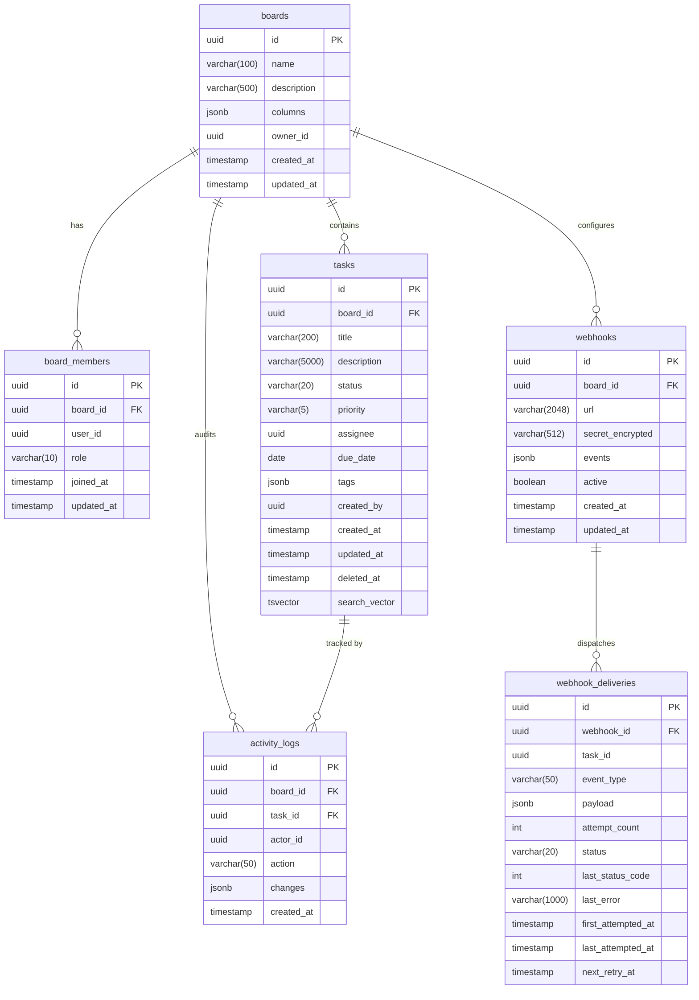
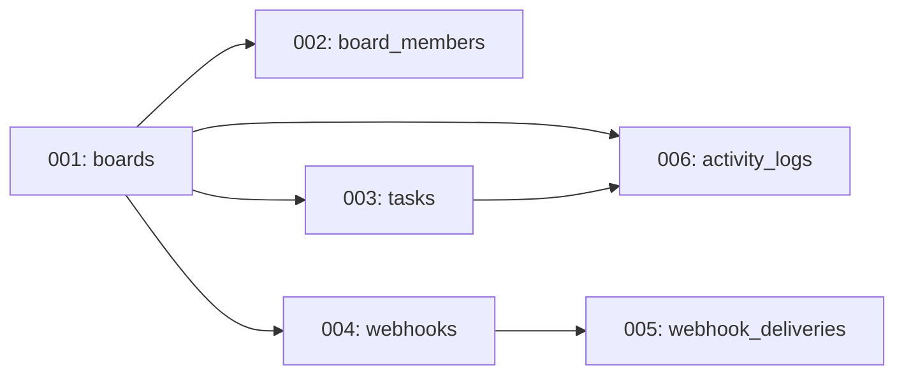

# Database Schema: TaskFlow API

**Cycle**: CYCLE-TASKFLOW-20260307-001
**Generated**: 2026-03-07
**Agent**: design-architect
**Version**: 1.0
**Database**: PostgreSQL 16

---

## 1. Entity-Relationship Diagram



---

## 2. Table Definitions

### 2.1 boards

Stores Kanban-style boards that organize tasks.

```sql
CREATE TABLE boards (
    id          UUID PRIMARY KEY DEFAULT gen_random_uuid(),
    name        VARCHAR(100) NOT NULL,
    description VARCHAR(500),
    columns     JSONB NOT NULL DEFAULT '["todo", "in_progress", "review", "done"]'::jsonb,
    owner_id    UUID NOT NULL,
    created_at  TIMESTAMPTZ NOT NULL DEFAULT now(),
    updated_at  TIMESTAMPTZ NOT NULL DEFAULT now(),

    CONSTRAINT boards_name_not_empty CHECK (length(trim(name)) > 0),
    CONSTRAINT boards_columns_min_2 CHECK (jsonb_array_length(columns) >= 2)
);

CREATE INDEX idx_boards_owner_id ON boards (owner_id);
```

### 2.2 board_members

Associates users with boards and their roles. Composite unique constraint ensures one membership per user-board pair.

```sql
CREATE TABLE board_members (
    id          UUID PRIMARY KEY DEFAULT gen_random_uuid(),
    board_id    UUID NOT NULL REFERENCES boards(id) ON DELETE CASCADE,
    user_id     UUID NOT NULL,
    role        VARCHAR(10) NOT NULL CHECK (role IN ('Admin', 'Member', 'Viewer')),
    joined_at   TIMESTAMPTZ NOT NULL DEFAULT now(),
    updated_at  TIMESTAMPTZ NOT NULL DEFAULT now(),

    CONSTRAINT uq_board_members_board_user UNIQUE (board_id, user_id)
);

CREATE INDEX idx_board_members_board_id ON board_members (board_id);
CREATE INDEX idx_board_members_user_id ON board_members (user_id);
CREATE INDEX idx_board_members_user_board ON board_members (user_id, board_id);
```

### 2.3 tasks

Stores all tasks. Soft-deleted tasks have a non-null `deleted_at`. Includes a `search_vector` column for full-text search.

```sql
CREATE TABLE tasks (
    id              UUID PRIMARY KEY DEFAULT gen_random_uuid(),
    board_id        UUID NOT NULL REFERENCES boards(id) ON DELETE CASCADE,
    title           VARCHAR(200) NOT NULL,
    description     VARCHAR(5000),
    status          VARCHAR(20) NOT NULL DEFAULT 'todo'
                    CHECK (status IN ('todo', 'in_progress', 'review', 'done')),
    priority        VARCHAR(5) NOT NULL DEFAULT 'P2'
                    CHECK (priority IN ('P0', 'P1', 'P2', 'P3')),
    assignee        UUID,
    due_date        DATE,
    tags            JSONB DEFAULT '[]'::jsonb,
    created_by      UUID NOT NULL,
    created_at      TIMESTAMPTZ NOT NULL DEFAULT now(),
    updated_at      TIMESTAMPTZ NOT NULL DEFAULT now(),
    deleted_at      TIMESTAMPTZ,
    search_vector   TSVECTOR,

    CONSTRAINT tasks_title_not_empty CHECK (length(trim(title)) > 0),
    CONSTRAINT tasks_tags_max_10 CHECK (jsonb_array_length(tags) <= 10)
);

-- Performance indexes
CREATE INDEX idx_tasks_board_id ON tasks (board_id) WHERE deleted_at IS NULL;
CREATE INDEX idx_tasks_board_status ON tasks (board_id, status) WHERE deleted_at IS NULL;
CREATE INDEX idx_tasks_board_priority ON tasks (board_id, priority) WHERE deleted_at IS NULL;
CREATE INDEX idx_tasks_board_assignee ON tasks (board_id, assignee) WHERE deleted_at IS NULL;
CREATE INDEX idx_tasks_board_due_date ON tasks (board_id, due_date) WHERE deleted_at IS NULL;
CREATE INDEX idx_tasks_created_by ON tasks (created_by);
CREATE INDEX idx_tasks_deleted_at ON tasks (deleted_at) WHERE deleted_at IS NOT NULL;

-- Full-text search GIN index
CREATE INDEX idx_tasks_search_vector ON tasks USING GIN (search_vector);

-- Trigger to auto-update search_vector on insert/update
CREATE OR REPLACE FUNCTION tasks_search_vector_update() RETURNS trigger AS $$
BEGIN
    NEW.search_vector :=
        setweight(to_tsvector('english', coalesce(NEW.title, '')), 'A') ||
        setweight(to_tsvector('english', coalesce(NEW.description, '')), 'B');
    RETURN NEW;
END;
$$ LANGUAGE plpgsql;

CREATE TRIGGER trg_tasks_search_vector
    BEFORE INSERT OR UPDATE OF title, description
    ON tasks
    FOR EACH ROW
    EXECUTE FUNCTION tasks_search_vector_update();

-- Trigger to auto-update updated_at
CREATE OR REPLACE FUNCTION update_updated_at() RETURNS trigger AS $$
BEGIN
    NEW.updated_at := now();
    RETURN NEW;
END;
$$ LANGUAGE plpgsql;

CREATE TRIGGER trg_tasks_updated_at
    BEFORE UPDATE ON tasks
    FOR EACH ROW
    EXECUTE FUNCTION update_updated_at();
```

### 2.4 webhooks

Stores webhook configurations per board. Secret is encrypted at rest.

```sql
CREATE TABLE webhooks (
    id                UUID PRIMARY KEY DEFAULT gen_random_uuid(),
    board_id          UUID NOT NULL REFERENCES boards(id) ON DELETE CASCADE,
    url               VARCHAR(2048) NOT NULL,
    secret_encrypted  VARCHAR(512) NOT NULL,
    events            JSONB NOT NULL DEFAULT '["task.created","task.updated","task.status_changed","task.assigned","task.deleted"]'::jsonb,
    active            BOOLEAN NOT NULL DEFAULT true,
    created_at        TIMESTAMPTZ NOT NULL DEFAULT now(),
    updated_at        TIMESTAMPTZ NOT NULL DEFAULT now()
);

CREATE INDEX idx_webhooks_board_id ON webhooks (board_id) WHERE active = true;

CREATE TRIGGER trg_webhooks_updated_at
    BEFORE UPDATE ON webhooks
    FOR EACH ROW
    EXECUTE FUNCTION update_updated_at();
```

### 2.5 webhook_deliveries

Records every webhook delivery attempt for auditing and retry management.

```sql
CREATE TABLE webhook_deliveries (
    id                  UUID PRIMARY KEY DEFAULT gen_random_uuid(),
    webhook_id          UUID NOT NULL REFERENCES webhooks(id) ON DELETE CASCADE,
    task_id             UUID,
    event_type          VARCHAR(50) NOT NULL,
    payload             JSONB NOT NULL,
    attempt_count       INTEGER NOT NULL DEFAULT 1,
    status              VARCHAR(20) NOT NULL DEFAULT 'pending'
                        CHECK (status IN ('pending', 'success', 'failed', 'permanently_failed')),
    last_status_code    INTEGER,
    last_error          VARCHAR(1000),
    first_attempted_at  TIMESTAMPTZ NOT NULL DEFAULT now(),
    last_attempted_at   TIMESTAMPTZ NOT NULL DEFAULT now(),
    next_retry_at       TIMESTAMPTZ
);

CREATE INDEX idx_webhook_deliveries_webhook_id ON webhook_deliveries (webhook_id);
CREATE INDEX idx_webhook_deliveries_status ON webhook_deliveries (status) WHERE status IN ('pending', 'failed');
CREATE INDEX idx_webhook_deliveries_next_retry ON webhook_deliveries (next_retry_at) WHERE status = 'failed' AND next_retry_at IS NOT NULL;
```

### 2.6 activity_logs

Immutable audit trail for all task mutations. No UPDATE or DELETE operations via API.

```sql
CREATE TABLE activity_logs (
    id          UUID PRIMARY KEY DEFAULT gen_random_uuid(),
    board_id    UUID NOT NULL REFERENCES boards(id) ON DELETE CASCADE,
    task_id     UUID REFERENCES tasks(id) ON DELETE SET NULL,
    actor_id    UUID NOT NULL,
    action      VARCHAR(50) NOT NULL
                CHECK (action IN ('task.created', 'task.updated', 'task.status_changed', 'task.assigned', 'task.deleted')),
    changes     JSONB NOT NULL,
    created_at  TIMESTAMPTZ NOT NULL DEFAULT now()
);

CREATE INDEX idx_activity_logs_board_id ON activity_logs (board_id);
CREATE INDEX idx_activity_logs_task_id ON activity_logs (task_id);
CREATE INDEX idx_activity_logs_created_at ON activity_logs (created_at);
CREATE INDEX idx_activity_logs_board_created ON activity_logs (board_id, created_at DESC);
CREATE INDEX idx_activity_logs_task_created ON activity_logs (task_id, created_at DESC);

-- Partition-ready: can be partitioned by created_at for retention
-- For now, retention is handled by a scheduled DELETE job
```

---

## 3. Index Strategy

| Table | Index | Type | Purpose |
|-------|-------|------|---------|
| boards | idx_boards_owner_id | B-tree | Lookup boards by owner |
| board_members | uq_board_members_board_user | Unique B-tree | One membership per user-board |
| board_members | idx_board_members_board_id | B-tree | List members of a board |
| board_members | idx_board_members_user_id | B-tree | List boards for a user |
| board_members | idx_board_members_user_board | B-tree (composite) | Fast membership lookup |
| tasks | idx_tasks_board_id | Partial B-tree | List active tasks on board |
| tasks | idx_tasks_board_status | Partial B-tree | Filter by status |
| tasks | idx_tasks_board_priority | Partial B-tree | Filter by priority |
| tasks | idx_tasks_board_assignee | Partial B-tree | Filter by assignee |
| tasks | idx_tasks_board_due_date | Partial B-tree | Filter by due date |
| tasks | idx_tasks_search_vector | GIN | Full-text search |
| tasks | idx_tasks_created_by | B-tree | Creator lookup for delete auth |
| tasks | idx_tasks_deleted_at | Partial B-tree | Find soft-deleted tasks |
| webhooks | idx_webhooks_board_id | Partial B-tree | Active webhooks per board |
| webhook_deliveries | idx_webhook_deliveries_webhook_id | B-tree | Deliveries per webhook |
| webhook_deliveries | idx_webhook_deliveries_status | Partial B-tree | Pending/failed deliveries |
| webhook_deliveries | idx_webhook_deliveries_next_retry | Partial B-tree | Retry queue polling |
| activity_logs | idx_activity_logs_board_id | B-tree | Board-level activity |
| activity_logs | idx_activity_logs_task_id | B-tree | Task-level activity |
| activity_logs | idx_activity_logs_created_at | B-tree | Retention purge |
| activity_logs | idx_activity_logs_board_created | B-tree (composite) | Board activity sorted by time |
| activity_logs | idx_activity_logs_task_created | B-tree (composite) | Task activity sorted by time |

---

## 4. Migration Plan

Migrations are applied in order using a simple migration runner (or a tool like `node-pg-migrate`).

| Migration | File | Description |
|-----------|------|-------------|
| 001 | 001-create-boards.sql | Create `boards` table with columns JSONB, owner_id, indexes |
| 002 | 002-create-board-members.sql | Create `board_members` table with unique constraint, indexes |
| 003 | 003-create-tasks.sql | Create `tasks` table, search_vector trigger, updated_at trigger, all indexes |
| 004 | 004-create-webhooks.sql | Create `webhooks` table with encrypted secret, indexes |
| 005 | 005-create-webhook-deliveries.sql | Create `webhook_deliveries` table with retry indexes |
| 006 | 006-create-activity-logs.sql | Create `activity_logs` table with composite indexes |

### Migration Execution Order



### Migration Strategy
- **Tool**: `node-pg-migrate` for versioned SQL migrations
- **Naming**: `{NNN}-{description}.sql` (e.g., `001-create-boards.sql`)
- **Rollback**: Each migration has a corresponding `down` script
- **Execution**: Run at application startup in production with lock to prevent concurrent migrations
- **Testing**: Migrations tested in CI against a fresh PostgreSQL 16 instance

---

## 5. Data Type Decisions

| Field | Type | Rationale |
|-------|------|-----------|
| Primary keys | UUID v4 | No sequential guessing; globally unique; safe for distributed systems |
| Timestamps | TIMESTAMPTZ | UTC storage with timezone awareness |
| Board columns | JSONB | Flexible ordered array; no need for a separate columns table |
| Task tags | JSONB | Flexible array; supports variable-length tag lists |
| Webhook events | JSONB | Flexible event type configuration |
| Activity changes | JSONB | Flexible before/after snapshots for arbitrary field changes |
| Webhook secret | VARCHAR (encrypted) | AES-256-GCM encrypted at application level before storage |
| Task status | VARCHAR with CHECK | Enforced at DB level; enum values: todo, in_progress, review, done |
| Member role | VARCHAR with CHECK | Enforced at DB level; enum values: Admin, Member, Viewer |

---

## 6. Soft Delete Strategy

- Tasks use `deleted_at TIMESTAMPTZ` column
- `NULL` = active; non-NULL = soft-deleted
- All read queries include `WHERE deleted_at IS NULL` by default
- Partial indexes exclude soft-deleted rows for performance
- No hard-delete endpoint; data recovery possible via direct DB access
- Soft-deleted tasks remain in `activity_logs` for audit continuity

---

## 7. Retention Policy Implementation

```sql
-- Retention purge: delete activity_logs older than 90 days
-- Executed by RetentionService via node-cron at 02:00 UTC daily
DELETE FROM activity_logs
WHERE created_at < now() - INTERVAL '90 days';
```

- Boundary: entries exactly 90 days old are **retained** (strictly greater than 90 days deleted)
- Batch deletion: delete in batches of 1000 to avoid long-running transactions
- Monitoring: log number of rows deleted per execution

---

## 8. Connection Pool Configuration

```typescript
const pool = new Pool({
    host: process.env.DB_HOST,
    port: parseInt(process.env.DB_PORT || '5432'),
    database: process.env.DB_NAME,
    user: process.env.DB_USER,
    password: process.env.DB_PASSWORD,
    ssl: process.env.DB_SSL === 'true' ? { rejectUnauthorized: true } : false,
    max: 20,                    // Maximum connections
    idleTimeoutMillis: 30000,   // Close idle connections after 30s
    connectionTimeoutMillis: 5000, // Fail fast if can't connect in 5s
    statement_timeout: 5000,    // Kill queries running > 5s
});
```
