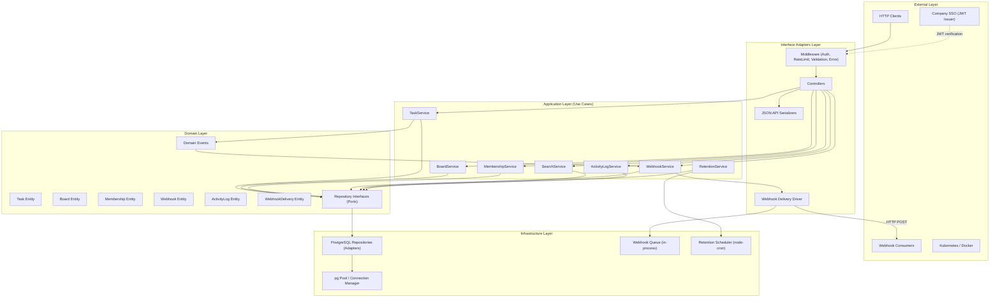
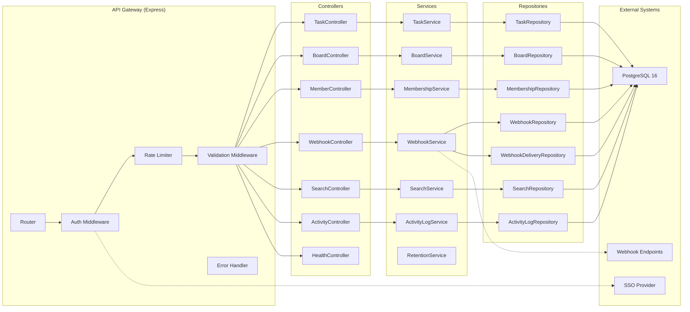
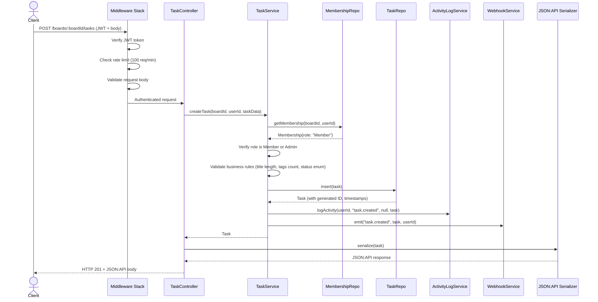
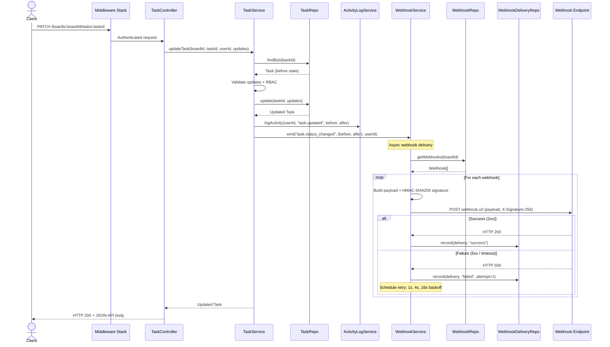
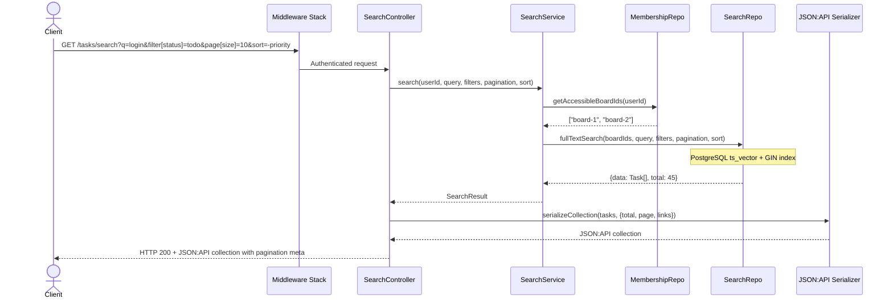
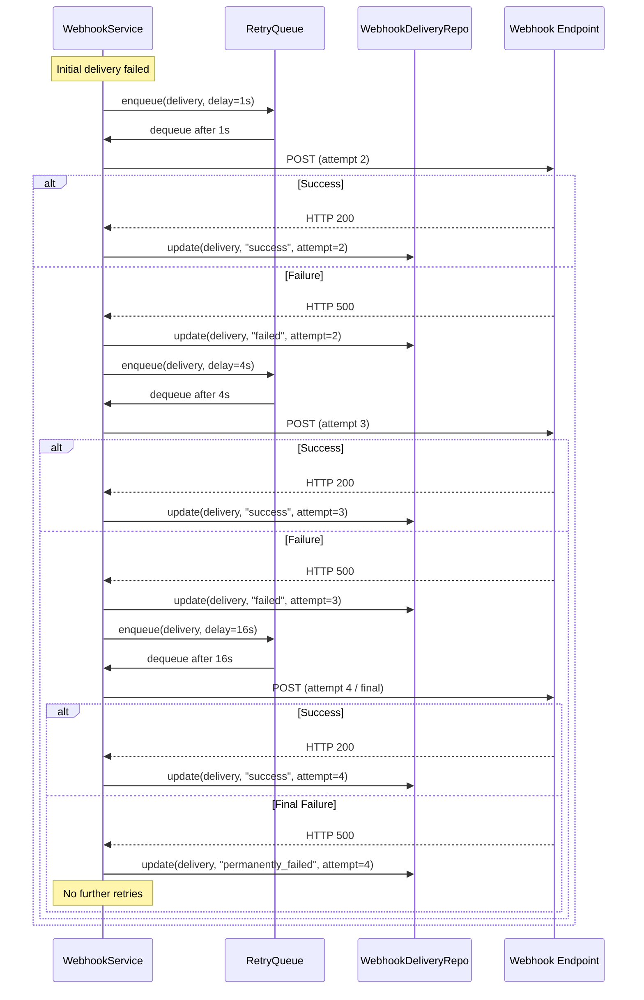
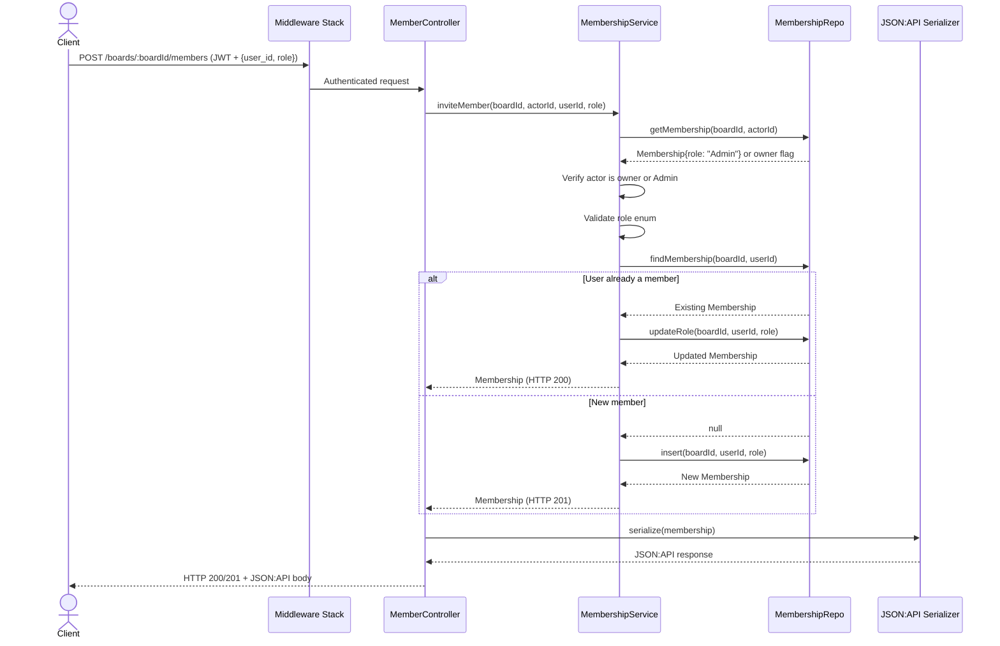
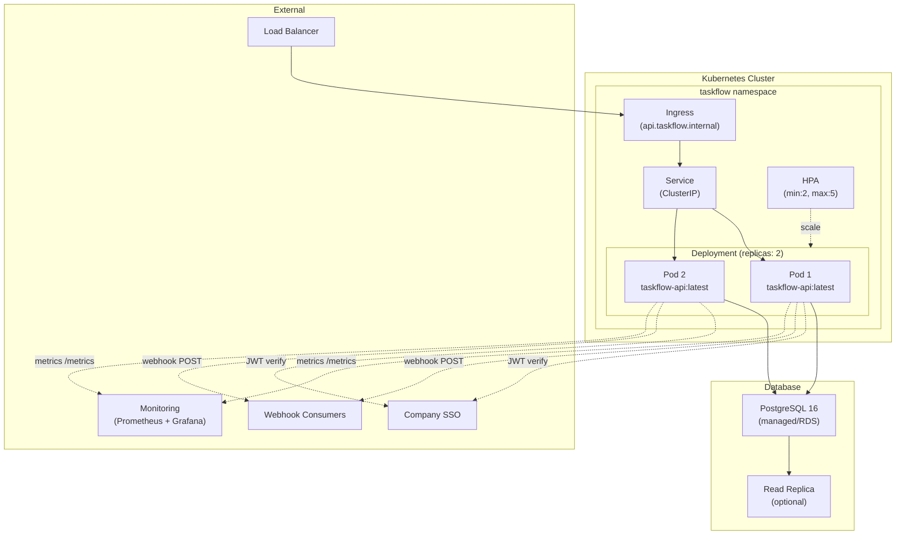

# Architecture Design: TaskFlow API

**Cycle**: CYCLE-TASKFLOW-20260307-001
**Generated**: 2026-03-07
**Agent**: design-architect
**Version**: 1.0

---

## 1. Architecture Overview

TaskFlow follows **Clean Architecture** with strict dependency inversion. External frameworks (Express, PostgreSQL) live at the outer layers; business logic is framework-agnostic at the core.

### 1.1 Layer Diagram



### 1.2 Component Diagram



---

## 2. Sequence Diagrams

### 2.1 Create Task Flow



### 2.2 Update Task with Webhook Delivery



### 2.3 Full-Text Search Flow



### 2.4 Webhook Retry Flow



### 2.5 Board Member Invite Flow



---

## 3. Directory Structure

```
taskflow-api/
├── src/
│   ├── domain/
│   │   ├── entities/
│   │   │   ├── task.ts
│   │   │   ├── board.ts
│   │   │   ├── membership.ts
│   │   │   ├── webhook.ts
│   │   │   ├── webhook-delivery.ts
│   │   │   └── activity-log.ts
│   │   ├── events/
│   │   │   └── domain-events.ts
│   │   ├── enums/
│   │   │   ├── task-status.ts
│   │   │   ├── task-priority.ts
│   │   │   ├── member-role.ts
│   │   │   └── webhook-event-type.ts
│   │   └── ports/
│   │       ├── task-repository.ts
│   │       ├── board-repository.ts
│   │       ├── membership-repository.ts
│   │       ├── webhook-repository.ts
│   │       ├── webhook-delivery-repository.ts
│   │       ├── search-repository.ts
│   │       └── activity-log-repository.ts
│   ├── application/
│   │   ├── services/
│   │   │   ├── task-service.ts
│   │   │   ├── board-service.ts
│   │   │   ├── membership-service.ts
│   │   │   ├── webhook-service.ts
│   │   │   ├── search-service.ts
│   │   │   ├── activity-log-service.ts
│   │   │   └── retention-service.ts
│   │   └── dto/
│   │       ├── create-task.dto.ts
│   │       ├── update-task.dto.ts
│   │       ├── create-board.dto.ts
│   │       ├── update-board.dto.ts
│   │       ├── invite-member.dto.ts
│   │       ├── create-webhook.dto.ts
│   │       └── search-query.dto.ts
│   ├── infrastructure/
│   │   ├── database/
│   │   │   ├── pool.ts
│   │   │   ├── migrations/
│   │   │   │   ├── 001-create-boards.sql
│   │   │   │   ├── 002-create-board-members.sql
│   │   │   │   ├── 003-create-tasks.sql
│   │   │   │   ├── 004-create-webhooks.sql
│   │   │   │   ├── 005-create-webhook-deliveries.sql
│   │   │   │   └── 006-create-activity-logs.sql
│   │   │   └── repositories/
│   │   │       ├── pg-task-repository.ts
│   │   │       ├── pg-board-repository.ts
│   │   │       ├── pg-membership-repository.ts
│   │   │       ├── pg-webhook-repository.ts
│   │   │       ├── pg-webhook-delivery-repository.ts
│   │   │       ├── pg-search-repository.ts
│   │   │       └── pg-activity-log-repository.ts
│   │   ├── queue/
│   │   │   └── webhook-retry-queue.ts
│   │   └── scheduler/
│   │       └── retention-scheduler.ts
│   ├── interface/
│   │   ├── http/
│   │   │   ├── app.ts
│   │   │   ├── server.ts
│   │   │   ├── middleware/
│   │   │   │   ├── auth.ts
│   │   │   │   ├── rate-limiter.ts
│   │   │   │   ├── validate.ts
│   │   │   │   ├── error-handler.ts
│   │   │   │   └── board-access.ts
│   │   │   ├── controllers/
│   │   │   │   ├── task-controller.ts
│   │   │   │   ├── board-controller.ts
│   │   │   │   ├── member-controller.ts
│   │   │   │   ├── webhook-controller.ts
│   │   │   │   ├── search-controller.ts
│   │   │   │   ├── activity-controller.ts
│   │   │   │   └── health-controller.ts
│   │   │   ├── routes/
│   │   │   │   ├── task-routes.ts
│   │   │   │   ├── board-routes.ts
│   │   │   │   ├── member-routes.ts
│   │   │   │   ├── webhook-routes.ts
│   │   │   │   ├── search-routes.ts
│   │   │   │   ├── activity-routes.ts
│   │   │   │   └── health-routes.ts
│   │   │   └── serializers/
│   │   │       ├── task-serializer.ts
│   │   │       ├── board-serializer.ts
│   │   │       ├── membership-serializer.ts
│   │   │       ├── webhook-serializer.ts
│   │   │       ├── activity-serializer.ts
│   │   │       └── error-serializer.ts
│   │   └── webhook/
│   │       └── webhook-delivery-driver.ts
│   └── config/
│       ├── index.ts
│       └── database.ts
├── test/
│   ├── unit/
│   ├── integration/
│   └── fixtures/
├── Dockerfile
├── docker-compose.yml
├── tsconfig.json
├── package.json
└── .env.example
```

---

## 4. Technology Stack

| Layer | Technology | Justification |
|-------|-----------|---------------|
| Runtime | Node.js v20+ | LTS, native ESM, performance |
| Language | TypeScript (strict mode) | Type safety, maintainability |
| Framework | Express.js | Lightweight, mature, extensive middleware ecosystem |
| Database | PostgreSQL 16 | Full-text search (tsvector), JSONB, reliability |
| DB Client | pg (node-postgres) | Direct SQL, full control, connection pooling |
| Auth | jsonwebtoken + jwks-rsa | JWT verification with SSO JWKS endpoint |
| Rate Limiting | express-rate-limit + rate-limit-redis | Token bucket per user, 100 req/min |
| Validation | zod | TypeScript-native schema validation |
| Serialization | jsonapi-serializer | JSON:API v1.1 compliance |
| Testing | node:test + supertest | Built-in test runner, HTTP integration testing |
| Coverage | c8 | Native V8 coverage |
| Container | Docker (multi-stage build) | Minimal image, K8s-ready |
| Scheduler | node-cron | Retention purge job (daily at 02:00 UTC) |
| HMAC | Node.js crypto (built-in) | HMAC-SHA256 for webhook signing |

---

## 5. Cross-Cutting Concerns

### 5.1 Authentication
- All requests pass through `auth` middleware
- JWT verified against SSO JWKS endpoint
- Token payload: `{ sub: userId, email, iat, exp }`
- Invalid/missing/expired tokens -> HTTP 401

### 5.2 Authorization (RBAC)
- Board-level roles: **Owner** (implicit, creator), **Admin**, **Member**, **Viewer**
- Checked at service layer via `MembershipRepository.getMembership(boardId, userId)`
- Permission matrix enforced per operation

### 5.3 Rate Limiting
- Token bucket: 100 requests per minute per authenticated user
- Key: `rl:{userId}`
- Exceeded -> HTTP 429 with `Retry-After` header

### 5.4 Error Handling
- Global error handler middleware
- All errors serialized as JSON:API error objects
- Structured: `{ errors: [{ status, title, detail, source? }] }`

### 5.5 Logging
- Structured JSON logs (pino)
- Request ID propagation via `X-Request-Id` header
- Log levels: error, warn, info, debug

### 5.6 Health Checks
- `GET /healthz` -- liveness (always 200 if process running)
- `GET /readyz` -- readiness (checks DB connection)

---

## 6. Deployment Diagram



### 6.1 Container Configuration

- **Base image**: `node:20-alpine`
- **Multi-stage build**: build stage (compile TS) + production stage (dist only)
- **Environment variables**: DB connection, JWT issuer URL, rate limit config
- **Resource limits**: 256Mi memory request, 512Mi limit; 100m CPU request, 500m limit
- **Probes**:
  - Liveness: `GET /healthz` every 10s, 3 failure threshold
  - Readiness: `GET /readyz` every 5s, 3 failure threshold
  - Startup: `GET /healthz` every 2s, 15 failure threshold (30s max startup)

---

## 7. Data Flow Summary

| Flow | Source | Components | Destination |
|------|--------|-----------|-------------|
| Task CRUD | HTTP Client | Auth MW -> Controller -> Service -> Repo | PostgreSQL |
| Board Mgmt | HTTP Client | Auth MW -> Controller -> Service -> Repo | PostgreSQL |
| Member Mgmt | HTTP Client | Auth MW -> Controller -> Service -> Repo | PostgreSQL |
| Webhook Config | HTTP Client | Auth MW -> Controller -> Service -> Repo | PostgreSQL |
| Webhook Delivery | Task Event | Service -> WebhookService -> DeliveryDriver | External URL |
| Search | HTTP Client | Auth MW -> Controller -> SearchService -> SearchRepo | PostgreSQL (FTS) |
| Activity Log | Task Mutation | Service -> ActivityLogService -> Repo | PostgreSQL |
| Retention Purge | Scheduler | RetentionService -> ActivityLogRepo | PostgreSQL |
| Health Check | K8s Probe | HealthController | HTTP Response |
